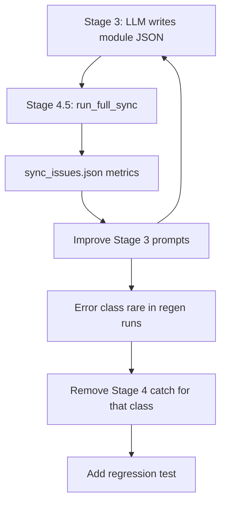

# Generation quality pipeline

How CodeWiki handles LLM output defects: **catch in Stage 4 first**, measure, improve Stage 3 prompts, then graduate fixes to tests.

## Stage numbering

| Label in logs | Code | Role |
|---------------|------|------|
| Stage 1–2 | `documentation_generator.py`, clustering | Dependency analysis, module tree |
| Stage 3 | `documentation_generator.py` | Parallel module doc generation |
| Stage 4-FAST / 4.3 | `agent_orchestrator.py` | Per-leaf: one-shot JSON (≤50 components) or pydantic-ai agent |
| Stage 3.5 | `_extract_all_diagrams` | Copy diagrams from `{module}.json` into `module_tree.json` |
| Stage 4.5 | `doc_file_sync.run_full_sync` | Post-sync catch-all (metadata, missing docs, diagram gaps, audits) |

Do **not** confuse agent_orchestrator “STAGE 4” (generation) with `doc_file_sync` “STAGE 4.5” (sync).

## Feedback loop

### Rules (for humans and agents)

1. **Never ask** “want me to fix/regenerate X?” — follow this pipeline.
2. **New error class** → add a **Stage 4 catch** first (log + metrics; optional placeholder when env allows).
3. **Measure** via `audit_docs_state` presync/postsync in `sync_issues.json`.
4. **Prompt fix** in `prompt_template.py` / `diagram_ir_validator.RULES_FOR_PROMPT` when the error class persists across regen runs.
5. **Graduate** → once prompts reliably prevent the error, remove the Stage 4 catch and add a **quality test** (`tests/`).

## Stage 4.5 catches (doc_file_sync.py)

| Step | Function | Catches | Action |
|------|----------|---------|--------|
| Presync | `audit_docs_state` | missing metadata, diagrams, **invalid_module_json_parse** | Read-only metrics |
| 1 | `ensure_overview_exists` | Missing `overview.json` | Creates from tree |
| 2 | `add_missing_metadata` | Missing title/description | Auto-fill + flag |
| 3 | `sync_docs_with_tree` | Missing doc, **JSON parse errors** | Log; placeholders if env on |
| 4 | `add_leaf_diagrams` | Leaf without diagram | Inject minimal diagram |
| 5 | `update_tree_diagrams` | Parent missing child nodes | Inject nodes/edges |
| 6 | `audit_diagram_ir_state` | R4 ELK issues | Audit only (no repair) |

`IssueType.JSON_PARSE_ERROR`: `{module}.json` exists but fails `json.loads` — treated as invalid/missing for sync.

## Prompt rules (Stage 3 prevention)

- `diagram_ir_validator.RULES_FOR_PROMPT` → appended in `prompt_template.py`
- Leaf JSON mode: `LEAF_JSON_SYSTEM_PROMPT`, `direct_module_doc.generate_leaf_doc_json`

## Quality tests

| Test | Guards |
|------|--------|
| `tests/test_no_repair_apis.py` | No reintroduced IR repair APIs |
| `tests/test_diagram_ir_validator.py` | IR validation rules |
| `tests/test_e2e_pipeline.py` | Demo repo structure |
| `tests/STAGE3_TEST_GAPS.md` | Coverage gaps vs contract |

## Adding a new catch

1. Add `IssueType` if needed in `doc_file_sync.py`.
2. Implement in `run_full_sync` path (or extend `audit_docs_state`).
3. Document in this file under Stage 4.5 table.
4. Add presync metric key if countable.
5. When prompt fix lands and regen runs show zero occurrences → add pytest + remove catch.

## Related

- `codewiki/docs/diagram-and-module-metadata.md` — metadata provenance
- `tests/STAGE3_TEST_GAPS.md` — test coverage gaps
- `scripts/batch_sync_metrics.py` — batch presync metrics
