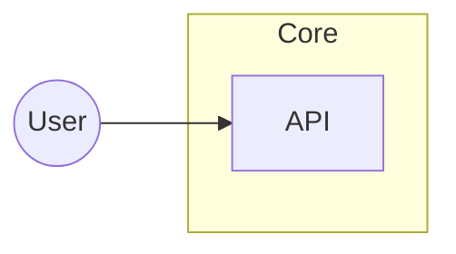

# Viewer pipeline R1 & R2 — reference for the generation-fix branch

This document describes what the **demo viewer** implements for **R1** (overview Mermaid → structured IR) and **R2** (deterministic IR repair before ELK). Use it as a spec when porting the same behavior into **Python** post-processors or validators on `fix/diagram-ir-generation` / `main`.

Related plan: `.cursor/plans/react-flow-elk_viewer_053242ef.plan.md` (milestones R1–R8).

---

## Context

- **Structured IR** matches the shape produced by `<!-- DIAGRAM_JSON -->` / `module_tree.json` → `diagram`: `{ direction?, nodes[], edges[], groups[] }`.
- **R1** only applies to **overview** when `overview.md` has **no** embedded `DIAGRAM_JSON` (today all six demo repos are Mermaid-only at overview).
- **R2** applies to **any** structured IR before ELK: diagram from `module_tree.json`, or from **R1** after conversion.

---

## R0 (brief)

- **Files:** [demo/index.html](../index.html)
- **Behavior:** “Mermaid” vs “React Flow” tabs; collapsible **Pipeline** sections for Source (R0), Overview Mermaid excerpt, R1, R2.
- **Source panel** exposes `structuredDiagram` from `overview.md` `DIAGRAM_JSON` when present, otherwise from `module_tree.json` → `diagram` for the current module (`structuredDiagram` on `moduleData`).

---

## R1 — Overview Mermaid → `DIAGRAM_JSON`

### Delivered files

| File | Role |
|------|------|
| [demo/pipeline-overview-mermaid.js](../pipeline-overview-mermaid.js) | Browser + Node (`require`) implementation |
| [demo/index.html](../index.html) | Loads script; **Pipeline · R1** prints `overviewMermaidToDiagramJson()` result |

### API

```js
overviewMermaidToDiagramJson(mermaidBodyString)
```

**Returns** (representative):

```json
{
  "ok": true,
  "diagram": {
    "direction": "LR",
    "nodes": [{ "id": "...", "label": "...", "type": "component|module", "link": "child.md" }],
    "edges": [{ "source": "...", "target": "...", "label": "" }],
    "groups": [{ "id": "...", "label": "...", "nodes": ["nodeId", "..."] }]
  },
  "warnings": [],
  "unsupportedLines": [],
  "unsupportedLineCount": 0,
  "counts": { "nodes": 6, "edges": 9, "groups": 5 }
}
```

- **`ok: false`** when too many unrecognized lines (`reason: "too_many_unsupported_lines"`) — partial `diagram` may still be present for debugging.
- **`click id "file.md"`** → node `type: "module"`, `link: "file.md"` (normalized to `*.md`).

### Supported Mermaid subset (intentionally narrow)

- Header: `flowchart TD|LR|…` or `graph TD|LR|…`
- **Subgraph:** `subgraph id["optional label"]` … `end` (nested subgraphs flattened into one group level)
- **Nodes:** `id["label"]`, `id[label]`, `id("label")`, `id(("label"))`
- **Edges:** `-->`, `==>`, `-.->` with optional `|"label"|`
- **Ignored:** `classDef`, `class`, `style` lines
- **Strip:** leading `%%` comments

### Verification done in-repo

- All six demo `overview.md` files parse with **`ok: true`** and **0** unsupported lines (`crewai`, `dspy`, `langchain`, `ollama`, `pydantic-ai`, `transformers`).

### Example for Python port

Input (excerpt from `overview.md` fenced `mermaid` block):



Expected IR properties:

- One group `core` containing `api`
- Edge `user → api`
- Node `api` has `type: module`, `link: "api.md"`

---

## R2 — IR repair (G2 / G3)

### Delivered files

| File | Role |
|------|------|
| [demo/pipeline-ir-repair.js](../pipeline-ir-repair.js) | `repairDiagramIR(diagram)` |
| [demo/index.html](../index.html) | **Pipeline · R2** runs repair on the same IR used for ELK prep (see below) |

### Input selection in the viewer (important)

`repairDiagramIR` is fed:

1. **Overview + file `DIAGRAM_JSON`:** use `overview.md` parsed JSON.
2. **Overview + Mermaid only:** use **R1 output** (`overviewMermaidToDiagramJson(...).diagram` when `ok`).
3. **Module:** use `module_tree.json` → `diagram` object for that module (`structuredDiagram`).

If there is no structured IR (e.g. module only has a Mermaid string in `.md` but no `diagram` object on the tree), R2 shows **skipped** in the panel.

### API

```js
repairDiagramIR(diagram)
```

**Returns:**

```json
{
  "ok": true,
  "diagram": { "direction": "TD", "nodes": [], "edges": [], "groups": [] },
  "warnings": [{ "code": "g2_injected_external", "nodeId": "missing_endpoint" }],
  "summary": {
    "g2Injected": ["missing_endpoint"],
    "g2EndpointIsGroupId": [{ "role": "source", "id": "SomeGroupId" }],
    "g3Lifted": [{ "groupId": "g", "nodeId": "lifted" }],
    "g3DroppedNonString": [],
    "g3DroppedUnknownMember": [{ "groupId": "g", "memberId": "ghost" }],
    "g3DroppedEmptyGroups": ["empty_group_id"],
    "before": { "nodeCount": 4, "edgeCount": 1, "groupCount": 2 },
    "after": { "nodeCount": 6, "edgeCount": 1, "groupCount": 1 }
  }
}
```

### Rules (mirror for Python)

| Code | Rule |
|------|------|
| **G3 lift** | If `groups[].nodes[]` entry is an **object** with `id`, merge into `nodes[]` (fill label/type/link), replace member with string `id`. Tag repaired nodes with `_repaired: "g3_lifted_from_group"` in JS (optional in Python). |
| **G3 drop** | Non-string group member → drop + warning `g3_drop_non_string_member`. |
| **G3 drop** | String member not in `nodes[].id` → drop + warning `g3_drop_unknown_member`. |
| **G3 drop group** | Group with **zero** members after cleanup → remove group + warning `g3_dropped_empty_group`. |
| **G2 inject** | For each edge `source` / `target`: if id **not** in `nodes` and **not** in `groups[].id`, append `{ id, label: id, type: "external", _repaired: "g2_injected_endpoint" }`. |
| **G2 group endpoint** | If endpoint string equals a **group id**, **do not** inject a node (avoids id collision). Warn `g2_endpoint_is_group_id`. ELK may later treat this as an edge between containers. |

### Example (synthetic)

**Before:**

```json
{
  "nodes": [{ "id": "a", "label": "A", "type": "component" }],
  "edges": [{ "source": "a", "target": "orphan_edge_target", "label": "x" }],
  "groups": [{ "id": "g1", "label": "G", "nodes": ["a", "ghost", { "id": "lifted", "label": "L", "type": "component" }] }]
}
```

**After (summary):**

- `g3_lifted`: `lifted` promoted from group member object into `nodes`.
- `g3_dropped_unknown_member`: `ghost` removed from group.
- `g2_injected`: `orphan_edge_target` added as `type: external`.

### Example (real data quirk — LangChain)

Some diagrams use edge endpoints that are **labels** matching **subgraph/group ids** (e.g. `Dumping` / `Loading`) rather than `nodes[].id`. R2 **warns** `g2_endpoint_is_group_id` and does **not** inject nodes with those ids, so group nodes and graph structure stay consistent for ELK.

---

## R4 — IR → ELK JSON (parsable graph input)

### Delivered files

| File | Role |
|------|------|
| [demo/pipeline-diagram-to-elk.js](../pipeline-diagram-to-elk.js) | `diagramToElkInput(diagram)`, `validateElkInputIdentifiers(elkGraph)` |
| [demo/index.html](../index.html) | **Pipeline · R4** prints ELK graph JSON after **R2-repaired** IR (fallback: raw IR if repair fails) |

### Contract

- Output matches Eclipse ELK **extended** JSON: root node with `children[]`, root-level `edges[]` entries shaped as `{ id, sources: [nodeId], targets: [nodeId] }`.
- **Official reference:** [JSON Format (ELK)](https://eclipse.dev/elk/documentation/tooldevelopers/graphdatastructure/jsonformat.html) and the [ELK documentation hub](https://eclipse.dev/elk/documentation.html).
- **ELK Live JSON editor** ([elklive/json](https://rtsys.informatik.uni-kiel.de/elklive/json.html)) uses a **strict** JSON importer: **`Every element must have an id`** — including **each label object**. Prose docs say label `id` is optional; the live editor still requires it. We emit `labels: [{ id: "<nodeId>__label_0", text, width, height }]`.
- **Default `target: 'elklive'`** uses short root `layoutOptions` like `{ "algorithm": "layered", "direction": "RIGHT" }` to match the editor’s examples. Use `diagramToElkInput(diagram, { target: 'elkjs' })` for `elk.algorithm` / `elk.direction` and extra spacing (better for `elkjs` in Node).
- Each **node** gets explicit `width`, `height`, and labeled labels as above (ELK does not auto-size text).
- **`diagram.direction`** maps to `layoutOptions.direction`: `RIGHT` / `LEFT` / `DOWN` / `UP`.
- **`groups[]`** → **compound** ELK nodes under root with `children` = member leaves; nodes not listed in any group become **direct** children of root.
- **First group wins** if a node id appears in multiple groups (deterministic).
- **Collision:** if `nodes[].id` equals `groups[].id`, that node is skipped with warning `r4_node_id_collides_with_group`.

### Verification

`validateElkInputIdentifiers(elkGraph)` walks all nested `children` and checks every edge `sources[]` / `targets[]` appears as a node id (matches importer expectations for connectivity).

### Layout smoke-test (optional)

```bash
npm install elkjs
```

```javascript
const ELK = require('elkjs/lib/elk.bundled.js');
const elk = new ELK();
const { diagramToElkInput } = require('./demo/pipeline-diagram-to-elk.js');
// … obtain repaired diagram …
elk.layout(diagramToElkInput(diagram).elkGraph).then(console.log);
```

---

## Suggested Python parity (generation-fix branch)

1. **`overview_mermaid_to_diagram_json(text: str) -> DiagramRepairResult`** — same subset as R1; unit-test against the six `demo/repos/*/overview.md` extractions.
2. **`repair_diagram_ir(diagram: dict) -> RepairResult`** — same ordering as JS: **G3 lift/drop/empty groups**, refresh node id set, then **G2** edges.
3. **Wire** `repair_diagram_ir` into documentation post-processing when writing `module_tree.json`, and optionally expose **`codewiki.tools.repair_diagram_ir`** as in the diagram-IR essentials plan.

---

## File checklist (demo)

| Piece | Path |
|-------|------|
| R1 | `demo/pipeline-overview-mermaid.js` |
| R2 | `demo/pipeline-ir-repair.js` |
| R4 | `demo/pipeline-diagram-to-elk.js` |
| Tab + pipeline UI | `demo/index.html` (script tags + `updatePipelinePanel`) |
| This doc | `demo/docs/pipeline-r1-r2-for-generation-branch.md` |
