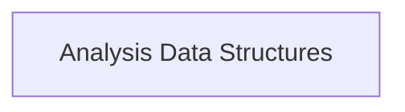

<!-- AUTO_GENERATED_PLACEHOLDER
  reason: LLM did not create .md file for this module
  module_path: data_types/workload_types/workload_analysis/analysis_data_structures
  component_count: 2
  generated_at: 2026-02-03T14:34:07.350932
  TODO: Fix LLM prompt to handle small leaf modules
-->

# Analysis Data Structures

> ⚠️ **Auto-Generated Placeholder**
> This documentation was auto-generated because the LLM failed to create it.
> Module path: `data_types/workload_types/workload_analysis/analysis_data_structures`

Defines the data structures used for workload analysis and recommendation results.

## Components

This module contains 2 component(s):

- `pkg.types.workloads.WorkloadAnalysisItem`
- `pkg.types.workloads.RecommendationAnalysisItem`

## Structure

---
*Auto-generated placeholder. See sync_issues.json for details.*
