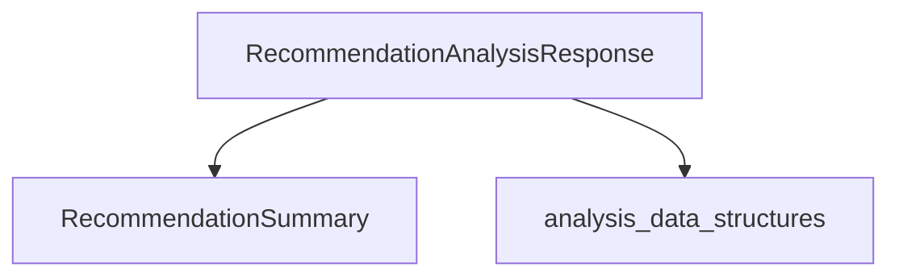

# analysis_responses Module Documentation

The `analysis_responses` module defines the data structures used to encapsulate the results and summary of recommendation analyses for workloads. It provides clear, structured formats for conveying insights related to CPU and memory adjustments.

## Core Components

### `RecommendationAnalysisResponse`

```go
type RecommendationAnalysisResponse struct {
	Analysis []RecommendationAnalysisItem `json:"analysis"`
	Summary  RecommendationSummary        `json:"summary"`
}
```

This struct represents the complete response of a recommendation analysis. It includes:
*   `Analysis`: A slice of [RecommendationAnalysisItem](analysis_data_structures.md) detailing individual workload analysis results.
*   `Summary`: A [RecommendationSummary](#recommendationsummary) providing an aggregated overview of the recommendations.

### `RecommendationSummary`

```go
type RecommendationSummary struct {
	TotalCurrentCPURequests    float64 `json:"total_current_cpu_requests"`
	TotalCPUDifferences        float64 `json:"total_cpu_differences"`
	TotalCurrentMemoryRequests float64 `json:"total_current_memory_requests"`
	TotalMemoryDifferences     float64 `json:"total_memory_differences"`
}
```

This struct provides a high-level summary of the recommendation analysis, including:
*   `TotalCurrentCPURequests`: The sum of current CPU requests across all analyzed workloads.
*   `TotalCPUDifferences`: The total difference in CPU requests suggested by the recommendations.
*   `TotalCurrentMemoryRequests`: The sum of current memory requests across all analyzed workloads.
*   `TotalMemoryDifferences`: The total difference in memory requests suggested by the recommendations.

## Architecture and Relationships

The `analysis_responses` module is a sub-module of `recommendation_responses`, which in turn is part of the `workload_types` and `data_types` hierarchy. It focuses specifically on the data models for the output of a recommendation analysis process. It leverages data structures defined in `analysis_data_structures` to provide detailed per-workload analysis.

<!-- DIAGRAM_JSON
{
    "direction": "TD",
    "nodes": [
        {"id": "recommendation_analysis_response", "label": "RecommendationAnalysisResponse", "type": "component", "link": null},
        {"id": "recommendation_summary", "label": "RecommendationSummary", "type": "component", "link": null},
        {"id": "analysis_data_structures", "label": "analysis_data_structures", "type": "external", "link": "analysis_data_structures.md"}
    ],
    "edges": [
        {"source": "recommendation_analysis_response", "target": "recommendation_summary"},
        {"source": "recommendation_analysis_response", "target": "analysis_data_structures"}
    ],
    "groups": []
}
-->


## How it Fits into the Overall System

This module plays a crucial role in the communication of recommendation results within the system. When a recommendation engine or a similar component performs an analysis, the results are formatted using the `RecommendationAnalysisResponse` structure. This response can then be consumed by various parts of the system, such as:

*   **API Handlers:** To serve the analysis results to external clients or user interfaces.
*   **Reporting Tools:** To generate reports or dashboards based on the recommendation summaries.
*   **Automation/Action Modules:** To trigger further actions based on the recommended changes, although the direct application logic would reside in other modules like `task_implementations`.

It acts as a standardized interface for representing complex recommendation data, ensuring consistency and ease of integration across different system components.