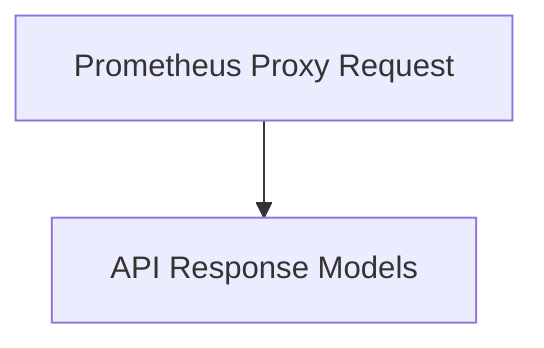

# API Data Models

## Introduction

The `api_data_models` module defines the core data structures used for communication with the recommender service API. These models are crucial for structuring requests and responses, ensuring consistent data exchange across the system.

## Architecture

The module is structured into logical sub-modules, each focusing on a specific set of data models. This separation enhances maintainability and clarity.

<!-- DIAGRAM_JSON
{
    "direction": "TD",
    "nodes": [
        {"id": "api_responses", "label": "API Response Models", "type": "module", "link": "api_responses.md"},
        {"id": "prometheus_proxy", "label": "Prometheus Proxy Request", "type": "module", "link": "prometheus_proxy.md"}
    ],
    "edges": [
        {"source": "prometheus_proxy", "target": "api_responses"}
    ],
    "groups": []
}
-->

## Sub-modules

This module contains the following sub-modules:

### [API Response Models](api_responses.md)
Defines the data structures for various API responses, including cluster information and general service status.

### [Prometheus Proxy Request](prometheus_proxy.md)
Defines the data structure for proxying requests to the Prometheus service.
