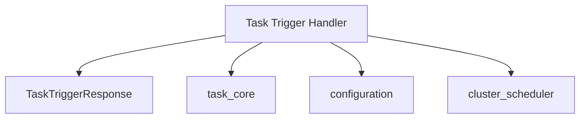

# api_handlers

The `api_handlers` module is responsible for defining and managing the API endpoints that allow external systems or internal components to trigger various tasks within the application. It acts as a gateway for initiating operations, ensuring proper request handling and providing standardized responses.

## Architecture and Component Relationships

This module primarily exposes endpoints for task invocation. It utilizes response structures to communicate the outcome of these operations.

<!-- DIAGRAM_JSON
{
    "direction": "TD",
    "nodes": [
        {"id": "task_trigger_handler", "label": "Task Trigger Handler", "type": "component", "link": null},
        {"id": "task_trigger_response", "label": "TaskTriggerResponse", "type": "component", "link": null},
        {"id": "task_core", "label": "task_core", "type": "external", "link": "task_core.md"},
        {"id": "configuration", "label": "configuration", "type": "external", "link": "configuration.md"},
        {"id": "cluster_scheduler", "label": "cluster_scheduler", "type": "external", "link": "cluster_scheduler.md"}
    ],
    "edges": [
        {"source": "task_trigger_handler", "target": "task_trigger_response"},
        {"source": "task_trigger_handler", "target": "task_core"},
        {"source": "task_trigger_handler", "target": "configuration"},
        {"source": "task_trigger_handler", "target": "cluster_scheduler"}
    ],
    "groups": []
}
-->



### Core Components

#### TaskTriggerResponse (`pkg.handlers.taskTrigger.TaskTriggerResponse`)

This Go struct defines the standard response format for API calls that trigger tasks. It provides information about the status, any associated messages, errors, and the duration of the operation.

```go
type TaskTriggerResponse struct {
	Status   string `json:"status"`
	Message  string `json:"message,omitempty"`
	Error    string `json:"error,omitempty"`
	Duration string `json:"duration,omitempty"`
}
```

-   **Status**: Indicates the overall status of the task triggering attempt (e.g., "success", "failed", "pending").
-   **Message**: An optional human-readable message providing more details about the operation's outcome.
-   **Error**: An optional field containing an error message if the task triggering failed.
-   **Duration**: An optional field indicating how long the task triggering operation took.

## Integration with the Overall System

The `api_handlers` module serves as the primary interface for initiating tasks. It interacts with:

-   **[task_core](task_core.md)**: To dispatch and manage the execution of various tasks.
-   **[configuration](configuration.md)**: To retrieve necessary server and task-specific settings.
-   **[cluster_scheduler](cluster_scheduler.md)**: Potentially to schedule tasks on specific clusters or allocate resources.

This module is crucial for enabling external control and automation of the system's operational workflows.