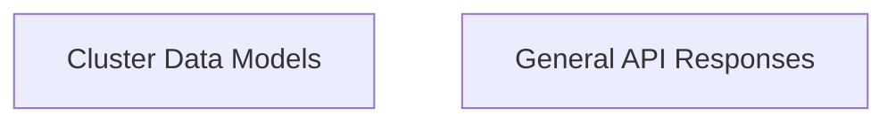

# API Responses Module

## Introduction
The `api_responses` module defines the data structures used for various API responses within the system. It ensures consistent formatting and easy consumption of data returned by the Recommender Service client. This module is a child of the `api_data_models` module and provides the foundational response types for client-side interactions.

## Architecture Overview

The `api_responses` module is composed of two main sub-modules: `cluster_data_models` and `general_api_responses`. These modules define the specific data structures for handling cluster-related information and general API feedback, respectively.

<!-- DIAGRAM_JSON
{
    "direction": "TD",
    "nodes": [
        {"id": "cluster_data_models", "label": "Cluster Data Models", "type": "module", "link": "cluster_data_models.md"},
        {"id": "general_api_responses", "label": "General API Responses", "type": "module", "link": "general_api_responses.md"}
    ],
    "edges": [],
    "groups": []
}
-->

## High-Level Functionality

### Cluster Data Models
This sub-module ([`cluster_data_models.md`](cluster_data_models.md)) focuses on the data structures related to cluster information. It defines how clusters and their associated details are represented in API responses.

### General API Responses
This sub-module ([`general_api_responses.md`](general_api_responses.md)) provides the data models for general API feedback, such as health checks and the root endpoint's message and available endpoints.

## Relationship to other modules
The `api_responses` module is a crucial part of the `recommender_client` and specifically the `api_data_models` module. It defines the concrete data types that the `recommender_client` uses to interpret responses from the Recommender Service.
