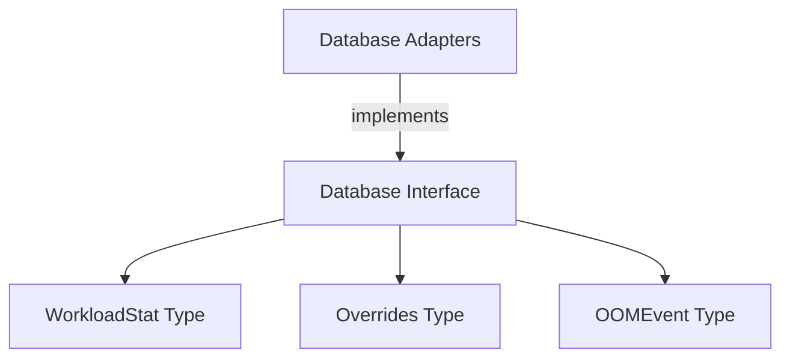

# application_ports Module Documentation

The `application_ports` module defines the core interfaces for interacting with the application's data persistence layer. It acts as an abstraction, decoupling the business logic from specific database implementations. This module ensures that different database backends can be swapped out without affecting the application's core functionality, adhering to the Dependency Inversion Principle.

## Core Functionality

The primary component of this module is the `Database` interface, which specifies a contract for all database operations, including:

*   **Data Upsertion:** Storing and updating workload statistics.
*   **Data Retrieval:** Fetching workload statistics, override configurations, and OOM (Out Of Memory) events based on various criteria (cluster ID, workload ID, time ranges).
*   **Data Existence Checks:** Verifying the presence of recent or existing statistics.
*   **Data Deletion:** Removing statistics and old OOM events.
*   **Data Updates:** Modifying workload override configurations.
*   **OOM Event Management:** Inserting, retrieving, and deleting OOM events.

By defining these operations in an interface, the `application_ports` module provides a clear and stable API for other parts of the system that need to interact with the database.

## Architecture and Component Relationships

The `Database` interface relies on several data types for its operations, which are defined in the [data_types module](data_types.md). Concrete implementations of this interface are provided by modules such as `database_adapters`, which handle the specifics of interacting with different database systems (e.g., PostgreSQL, SQLite).

<!-- DIAGRAM_JSON
{
    "direction": "TD",
    "nodes": [
        {"id": "database_interface", "label": "Database Interface", "type": "component", "link": null},
        {"id": "workload_stat", "label": "WorkloadStat Type", "type": "external", "link": "data_types.md"},
        {"id": "overrides_type", "label": "Overrides Type", "type": "external", "link": "data_types.md"},
        {"id": "oom_event_type", "label": "OOMEvent Type", "type": "external", "link": "data_types.md"},
        {"id": "database_adapters", "label": "Database Adapters", "type": "external", "link": "database_adapters.md"}
    ],
    "edges": [
        {"source": "database_interface", "target": "workload_stat"},
        {"source": "database_interface", "target": "overrides_type"},
        {"source": "database_interface", "target": "oom_event_type"},
        {"source": "database_adapters", "target": "database_interface", "label": "implements"}
    ],
    "groups": []
}
-->

## How the Module Fits into the Overall System

The `application_ports` module serves as a critical bridge between the application's core logic and its persistent storage. Any module that needs to store or retrieve data interacts with the `Database` interface defined here. This includes:

*   **[oom_event_processing](oom_event_processing.md):** For inserting and querying OOM events.
*   **[task_implementations](task_implementations.md):** Tasks like `CreateStatsTask`, `CleanupOOMEventsTask`, and `ApplyRecommendationTask` would utilize this interface to persist their results and fetch necessary data.
*   **[data_storage_repository](data_storage_repository.md):** While `data_storage_repository` likely defines another layer of abstraction over raw storage, it might internally use or be related to the concepts defined in `application_ports` for database interaction.
*   **[api_handlers](api_handlers.md):** API endpoints that expose data or allow data manipulation would interact with the `Database` interface to fulfill requests.

By defining a clear contract, `application_ports` ensures maintainability, testability, and flexibility in database management across the entire application.
