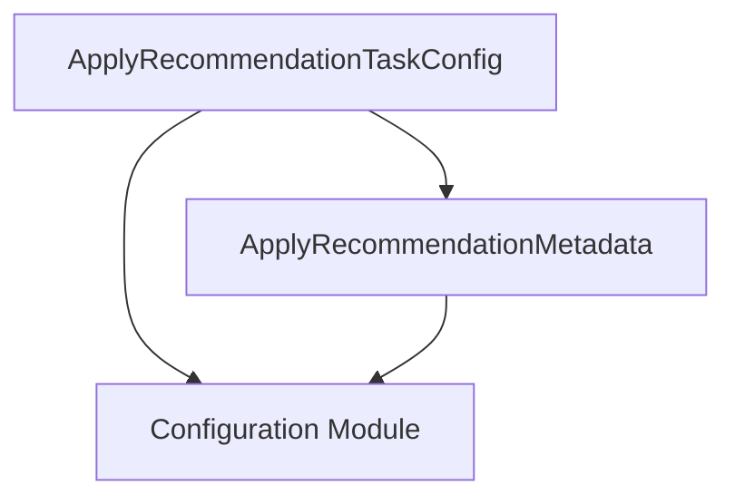

# Module: apply_recommendation_configuration

## Introduction
This module defines the configuration structures necessary for the `ApplyRecommendationTask` within the system. It encapsulates settings related to dry runs, URLs for node statistics and overrides, and specific task execution parameters like scheduling and target cluster information.

## Purpose and Core Functionality
The `apply_recommendation_configuration` module provides the data structures that govern how recommendations are applied to a cluster. Its primary role is to define:
*   `ApplyRecommendationMetadata`: Contains flags and URLs crucial for the recommendation application process, such as whether to perform a dry run, the endpoints for fetching node statistics, and override settings.
*   `ApplyRecommendationTaskConfig`: Holds the comprehensive configuration for the `ApplyRecommendationTask`, including task enablement, scheduling, target cluster details, authentication, and integration with broader recommendation settings.

These configurations enable flexible and controlled execution of the recommendation application logic, allowing for different environments and operational requirements.

## Architecture and Component Relationships

<!-- DIAGRAM_JSON
{
    "direction": "TD",
    "nodes": [
        {"id": "apply_recommendation_metadata", "label": "ApplyRecommendationMetadata", "type": "component", "link": null},
        {"id": "apply_recommendation_task_config", "label": "ApplyRecommendationTaskConfig", "type": "component", "link": null},
        {"id": "configuration", "label": "Configuration Module", "type": "external", "link": "configuration.md"}
    ],
    "edges": [
        {"source": "apply_recommendation_task_config", "target": "apply_recommendation_metadata"},
        {"source": "apply_recommendation_task_config", "target": "configuration"},
        {"source": "apply_recommendation_metadata", "target": "configuration"}
    ],
    "groups": []
}
-->

### Component Descriptions:

*   **`ApplyRecommendationMetadata`**: This structure defines metadata specific to the application of recommendations. It includes:
    *   `DryRun`: A boolean indicating if the recommendation application should be a dry run (simulate without actual changes).
    *   `NodeStatsURL`: A URL configuration pointing to the endpoint for node statistics, referenced from the [configuration module](configuration.md).
    *   `OverridesURL`: A URL configuration for fetching override settings, also from the [configuration module](configuration.md).
    *   `SkipMemory`: A boolean flag to skip memory recommendations.

*   **`ApplyRecommendationTaskConfig`**: This is the main configuration structure for the `ApplyRecommendationTask`. It encompasses:
    *   `Name`: The name of the task.
    *   `Enabled`: A boolean to enable or disable the task.
    *   `Schedule`: The schedule for the task's execution.
    *   `ClusterID`: The ID of the cluster where the task is running.
    *   `TargetClusterID`: The ID of the target cluster for applying recommendations.
    *   `TargetNamespace`: The namespace within the target cluster.
    *   `IsClusterWriteAuthorized`: A boolean indicating if the system has write authorization to the target cluster.
    *   `BasicAuth`: Basic authentication configuration, linked to the [configuration module](configuration.md).
    *   `RecommendationSettings`: General recommendation settings, also from the [configuration module](configuration.md).
    *   `Metadata`: An embedded `ApplyRecommendationMetadata` structure.

## How the Module Fits into the Overall System
The `apply_recommendation_configuration` module is a crucial part of the `apply_recommendation_tasks` sub-module, which itself is part of `task_implementations`. It provides the foundational configuration blueprints for the `ApplyRecommendationTask` (defined in [task_execution_and_results.md](task_execution_and_results.md)).

By defining clear and structured configuration objects, this module enables the system to:
*   Dynamically configure the behavior of recommendation application based on environmental variables or specific deployment requirements.
*   Separate configuration concerns from the core task logic, promoting maintainability and reusability.
*   Integrate with the global [configuration module](configuration.md) to leverage shared settings for URLs, authentication, and recommendation parameters.

This module ensures that the `ApplyRecommendationTask` operates with the correct parameters, whether it's performing a dry run, interacting with specific API endpoints, or applying recommendations to a designated cluster and namespace.
