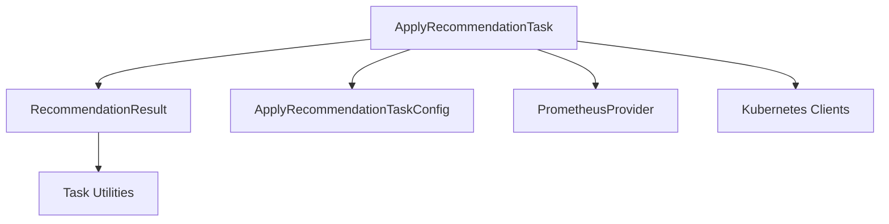

# apply_recommendation_execution Module

## Introduction

The `apply_recommendation_execution` module is a critical component within the task implementation framework, specifically responsible for the execution of resource recommendations and the structured storage of their outcomes. This module encapsulates the core logic for applying recommended changes to a cluster and provides a standardized format for reporting the results of such operations.

## Core Functionality

This module defines two primary components:

### `ApplyRecommendationTask`

The `ApplyRecommendationTask` struct represents an executable task designed to apply calculated recommendations to a Kubernetes cluster. It orchestrates interactions with various external systems to achieve its goal:

*   **Configuration**: It holds a reference to `ApplyRecommendationTaskConfig` (defined in [apply_recommendation_configuration.md]), which dictates the parameters and settings for the recommendation application process.
*   **Kubernetes Interaction**: Through `kubeClient` and `dynamicClient` (Kubernetes API clients, typically managed by the [cluster_management.md] module), the task can interact with Kubernetes resources to apply changes such as updating container resource requests and limits.
*   **Metrics Provisioning**: It utilizes a `PrometheusProvider` (from [metrics_provider_prometheus.md]) for potential metric gathering, which might be used for pre-checks, post-checks, or validation of the applied recommendations.

### `RecommendationResult`

The `RecommendationResult` struct serves as a data container for the detailed outcome of an `ApplyRecommendationTask` execution. It captures comprehensive information about the application process:

*   **Node Context**: `NodeName` and `NodeInfo` provide specifics about the node where recommendations were applied or intended for. `NodeInfo` uses types from [task_utilities.md].
*   **Pod and Container Recommendations**: `PodContainerRecommendations` is a list of specific changes recommended for individual pods and containers, leveraging data structures defined in [task_utilities.md].
*   **Non-Optimizable Pods**: `NonOptimizablePods` lists any pods that could not be optimized for various reasons, also using types from [task_utilities.md].
*   **Resource Metrics**: `MaxRestCPU` and `MaxRestMemory` provide insights into the remaining CPU and memory resources on the node after applying recommendations, helping to assess the impact and available capacity.

## Architecture and Component Relationships

The `apply_recommendation_execution` module integrates the `ApplyRecommendationTask` with the `RecommendationResult` to form a complete execution and reporting cycle. The `ApplyRecommendationTask` is responsible for initiating and overseeing the process of applying recommendations, utilizing its configured clients to interact with the Kubernetes API and Prometheus. Once the application process concludes, it populates a `RecommendationResult` object with all relevant details, including the specific changes made, any issues encountered, and the resulting resource state.

The task relies heavily on configuration provided by `apply_recommendation_configuration` and utilizes external services like `metrics_provider_prometheus` and Kubernetes clients (abstracted via `cluster_management`) to perform its operations. The output of the task, the `RecommendationResult`, makes extensive use of shared data types defined in `task_utilities`.

<!-- DIAGRAM_JSON
{
    "direction": "TD",
    "nodes": [
        {"id": "apply_recommendation_task", "label": "ApplyRecommendationTask", "type": "component", "link": null},
        {"id": "recommendation_result", "label": "RecommendationResult", "type": "component", "link": null},
        {"id": "apply_recommendation_configuration", "label": "ApplyRecommendationTaskConfig", "type": "external", "link": "apply_recommendation_configuration.md"},
        {"id": "metrics_provider_prometheus", "label": "PrometheusProvider", "type": "external", "link": "metrics_provider_prometheus.md"},
        {"id": "cluster_management_kube", "label": "Kubernetes Clients", "type": "external", "link": "cluster_management.md"},
        {"id": "task_utilities", "label": "Task Utilities", "type": "external", "link": "task_utilities.md"}
    ],
    "edges": [
        {"source": "apply_recommendation_task", "target": "apply_recommendation_configuration"},
        {"source": "apply_recommendation_task", "target": "metrics_provider_prometheus"},
        {"source": "apply_recommendation_task", "target": "cluster_management_kube"},
        {"source": "apply_recommendation_task", "target": "recommendation_result"},
        {"source": "recommendation_result", "target": "task_utilities"}
    ],
    "groups": []
}
-->

## How the Module Fits into the Overall System

The `apply_recommendation_execution` module is nested deeply within the `task_implementations` family, specifically as part of the `apply_recommendation_tasks` and `task_execution_and_results` sub-modules. It represents the concrete implementation of applying recommendations as a scheduled or triggered task.

It receives its directives from the `task_configuration` (specifically `apply_recommendation_configuration`) and interacts with the Kubernetes API via components typically provided by the `cluster_management` module. Metric data, if needed for validation or pre-checks, is sourced from `metrics_provider_prometheus`. The results generated by this module (`RecommendationResult`) are crucial for auditing, reporting, and potentially for subsequent tasks (e.g., `create_stats_tasks` for performance analysis or `data_storage_repository` for persistence). This module therefore serves as the active agent that translates calculated recommendations into tangible changes within the cluster environment.
