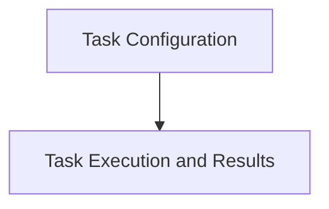

# Apply Recommendation Tasks Module

## Introduction

The `apply_recommendation_tasks` module is responsible for orchestrating and executing the process of applying resource recommendations to a Kubernetes cluster. It defines the core task structure, its configuration, and the format for recording recommendation results. This module is a critical component for automated resource optimization within the system.

## Architecture Overview

The `apply_recommendation_tasks` module is composed of two main sub-modules: `task_configuration` and `task_execution_and_results`. These sub-modules work in conjunction to define, configure, and execute the recommendation application process.

<!-- DIAGRAM_JSON
{
    "direction": "TD",
    "nodes": [
        {"id": "task_configuration", "label": "Task Configuration", "type": "module", "link": "task_configuration.md"},
        {"id": "task_execution_and_results", "label": "Task Execution and Results", "type": "module", "link": "task_execution_and_results.md"}
    ],
    "edges": [
        {"source": "task_configuration", "target": "task_execution_and_results"}
    ],
    "groups": []
}
-->

## Sub-modules

### [Task Configuration](task_configuration.md)

This sub-module defines the necessary configuration and metadata for the `ApplyRecommendationTask`. It includes settings for task scheduling, target cluster identification, authentication, and specific parameters for how recommendations should be applied, such as dry-run options or URL configurations for external data sources. For more details, refer to the [Task Configuration documentation](task_configuration.md).

### [Task Execution and Results](task_execution_and_results.md)

This sub-module encapsulates the core logic for executing the `ApplyRecommendationTask`, including interactions with Kubernetes and Prometheus clients. It also defines the structure for `RecommendationResult`, which captures the outcome of applying recommendations, including information about the node, successful container modifications, and any non-optimizable pods. For more details, refer to the [Task Execution and Results documentation](task_execution_and_results.md).