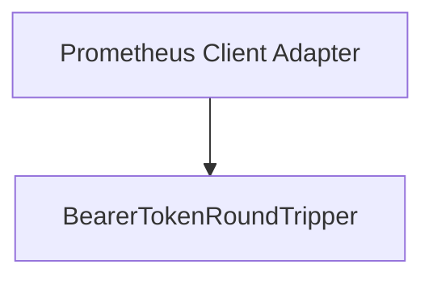

# Module: authentication_handler

## Introduction
The `authentication_handler` module is responsible for handling authentication concerns within the Prometheus client adapter, specifically by injecting a bearer token into outgoing HTTP requests. It ensures secure communication with the Prometheus server when authentication is required.

## Core Functionality
The primary component of this module, `BearerTokenRoundTripper`, acts as an HTTP `RoundTripper` middleware. It intercepts HTTP requests, adds a specified bearer token to the Authorization header, and then proxies the request to an underlying `http.RoundTripper`. This mechanism centralizes the authentication logic for all Prometheus-related API calls.

## Architecture and Relationships

<!-- DIAGRAM_JSON
{
    "direction": "TD",
    "nodes": [
        {"id": "bearer_token_round_tripper", "label": "BearerTokenRoundTripper", "type": "component", "link": null},
        {"id": "prometheus_client_adapter", "label": "Prometheus Client Adapter", "type": "external", "link": "prometheus_client_adapter.md"}
    ],
    "edges": [
        {"source": "prometheus_client_adapter", "target": "bearer_token_round_tripper"}
    ],
    "groups": []
}
-->

## How it Fits into the Overall System
The `authentication_handler` module is a crucial sub-component of the [prometheus_client_adapter](prometheus_client_adapter.md), which itself is part of the broader [metrics_provider_prometheus](metrics_provider_prometheus.md). It provides a standardized and secure way for the system to authenticate with Prometheus instances that require bearer token authentication. By abstracting the token injection logic, it ensures that all Prometheus queries originating from the client adapter are properly authorized without needing to repeat authentication logic across different parts of the Prometheus client. This promotes maintainability and security within the metrics gathering subsystem.
