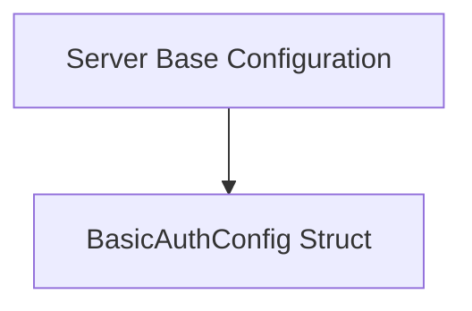

# `basic_authentication_config`

The `basic_authentication_config` module is a vital part of the system's security configuration, specifically handling basic HTTP authentication settings. It defines the structure for storing sensitive credentials like usernames and passwords, which are essential for securing various server endpoints.

### Purpose and Core Functionality

The primary purpose of the `basic_authentication_config` module is to encapsulate the configuration required for basic authentication. It provides a clear and structured way to define the `Username` and `Password` that a server will use to authenticate incoming requests. This separation of concerns ensures that authentication credentials are handled consistently across the application's configuration.

The core component of this module is:

*   **`pkg.config.config.BasicAuthConfig`**: This Go struct defines two fields: `Username` and `Password`. Both are tagged with `yaml` and `mapstructure` annotations, indicating they are intended for configuration deserialization from YAML files and mapping to Go struct fields respectively. This struct serves as a data model for basic authentication credentials.

### Architecture and Component Relationships

The `basic_authentication_config` module is a leaf module within the broader [configuration module](configuration.md) tree. It resides specifically under `server_configuration` and `server_base_configuration`, indicating its direct relevance to how the server itself is configured.

*   **`BasicAuthConfig`**: This struct is directly used by the [server_base_configuration module](server_base_configuration.md), which typically aggregates various server-related settings, including authentication.
*   **`server_settings`**: The `server_settings` module, which defines the overall [ServerConfig](server_settings.md), would incorporate an instance of `BasicAuthConfig` to manage the server's authentication parameters.

<!-- DIAGRAM_JSON
{
    "direction": "TD",
    "nodes": [
        {"id": "basic_auth_config_struct", "label": "BasicAuthConfig Struct", "type": "component", "link": null},
        {"id": "server_base_configuration", "label": "Server Base Configuration", "type": "external", "link": "server_base_configuration.md"}
    ],
    "edges": [
        {"source": "server_base_configuration", "target": "basic_auth_config_struct"}
    ],
    "groups": []
}
-->

### How the Module Fits into the Overall System

The `basic_authentication_config` module plays a crucial role in securing the application's server. By defining the `BasicAuthConfig` struct, it provides a standardized way for the system to:

1.  **Load Basic Authentication Credentials**: The configuration system can easily parse username and password details from configuration files (e.g., YAML) into this struct.
2.  **Integrate with Server Setup**: The server initialization logic, defined within modules like `server_base_configuration` and [server_settings](server_settings.md), can directly use the `BasicAuthConfig` instance to set up basic authentication middleware or handlers for protected endpoints.
3.  **Maintain Consistency**: Centralizing the definition of basic authentication within this module ensures that all parts of the server requiring such credentials refer to a single, consistent structure, reducing the risk of misconfiguration or security vulnerabilities.

This module ensures that basic authentication is a configurable and integral part of the overall application security posture.