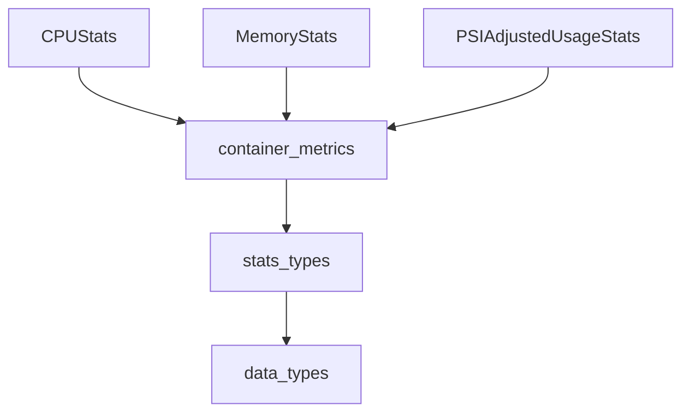

The `basic_resource_stats` module provides fundamental data structures for representing basic CPU, memory, and PSI (Pressure Stall Information) adjusted usage statistics for containers. These statistics are crucial for understanding the resource consumption patterns of individual containers within a Kubernetes cluster, forming the building blocks for more complex metrics and recommendations.

### Core Functionality

This module defines the following key data structures:

*   **`CPUStats`**: Represents CPU usage statistics, including the maximum observed usage (`Max`), the 50th percentile (`P50`), and the 75th percentile (`P75`). These metrics help in assessing typical and peak CPU demands.
*   **`MemoryStats`**: Encapsulates memory usage statistics, providing the maximum observed usage (`Max`), the 75th percentile (`P75`), and an optional `OOMMemory` field, which indicates the memory at the time of an Out-Of-Memory (OOM) event. This helps in identifying memory-intensive containers and potential OOM issues.
*   **`PSIAdjustedUsageStats`**: Represents CPU usage statistics adjusted by Pressure Stall Information. Similar to `CPUStats`, it includes `Max`, `P50`, and `P75` values, but with an emphasis on identifying resource pressure. PSI metrics are valuable for understanding performance bottlenecks due to resource contention.

These components are foundational for other modules that aggregate, analyze, or visualize container-level resource data.

### Architecture and Component Relationships

The `basic_resource_stats` module is a leaf module within the broader `data_types` and `stats_types` hierarchy. It defines basic statistical data structures that are consumed by higher-level modules, such as [container_metrics.md](container_metrics.md), to form comprehensive container metric summaries.

<!-- DIAGRAM_JSON
{
    "direction": "TD",
    "nodes": [
        {"id": "cpu_stats", "label": "CPUStats", "type": "component", "link": null},
        {"id": "memory_stats", "label": "MemoryStats", "type": "component", "link": null},
        {"id": "psi_adjusted_usage_stats", "label": "PSIAdjustedUsageStats", "type": "component", "link": null},
        {"id": "container_metrics", "label": "container_metrics", "type": "external", "link": "container_metrics.md"},
        {"id": "stats_types", "label": "stats_types", "type": "external", "link": "stats_types.md"},
        {"id": "data_types", "label": "data_types", "type": "external", "link": "data_types.md"}
    ],
    "edges": [
        {"source": "cpu_stats", "target": "container_metrics"},
        {"source": "memory_stats", "target": "container_metrics"},
        {"source": "psi_adjusted_usage_stats", "target": "container_metrics"},
        {"source": "container_metrics", "target": "stats_types"},
        {"source": "stats_types", "target": "data_types"}
    ],
    "groups": []
}
-->

### System Integration

The `basic_resource_stats` module's components are fundamental to the overall system's ability to collect, store, and process container resource usage data. They are consumed by the [container_metrics.md](container_metrics.md) module to construct the `ContainerStats` object, which provides a comprehensive summary of a container's resource usage. This `ContainerStats` object is then used throughout the system, including in the [data_storage_repository.md](data_storage_repository.md) for persistence, by the [task_implementations.md](task_implementations.md) for tasks like `CreateStatsTask` and `FetchMetricsTask`, and eventually for generating recommendations or displaying performance insights to users. By providing a standardized way to represent basic resource statistics, this module ensures consistency and interoperability across different parts of the system dealing with container performance metrics.