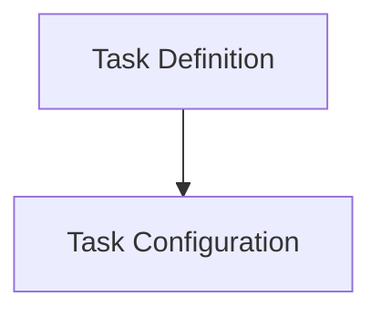

# cleanup_oom_tasks Module Documentation

## Introduction

The `cleanup_oom_tasks` module is responsible for defining and managing tasks related to cleaning up Out-Of-Memory (OOM) events within the system. This module ensures that old or irrelevant OOM event data is periodically removed to maintain database hygiene and optimize performance. It provides the core structures for configuring and executing these cleanup operations.

## Architecture Overview

The module is composed of two primary sub-modules:
- **Task Configuration**: Handles the definition of task-specific metadata and general configuration.
- **Task Definition**: Defines the actual structure of the cleanup task and its dependencies.

<!-- DIAGRAM_JSON
{
    "direction": "TD",
    "nodes": [
        {"id": "task_configuration", "label": "Task Configuration", "type": "module", "link": "task_configuration.md"},
        {"id": "task_definition", "label": "Task Definition", "type": "module", "link": "task_definition.md"}
    ],
    "edges": [
        {"source": "task_definition", "target": "task_configuration"}
    ],
    "groups": []
}
-->

## High-Level Functionality

### Task Configuration ([task_configuration.md](task_configuration.md))
This sub-module defines the `CleanupOOMEventsMetadata` and `CleanupOOMEventsTaskConfig` structures. It specifies parameters such as retention days for OOM events, task name, enablement status, schedule, and cluster ID, which are crucial for the proper functioning and scheduling of the cleanup task.

### Task Definition ([task_definition.md](task_definition.md))
This sub-module encompasses the `CleanupOOMEventsTask` structure, which represents the core cleanup task. It integrates the task configuration and depends on the `data_storage_repository` module for interacting with the database to perform cleanup operations. This task is responsible for orchestrating the actual deletion of OOM events based on the configured retention policy.
