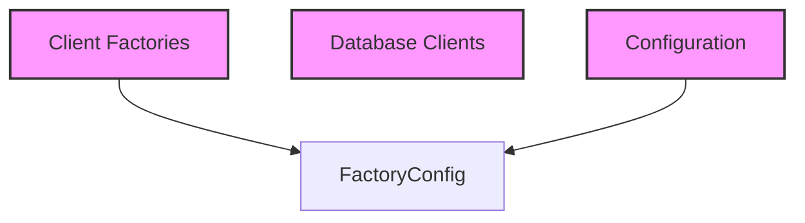

# Module: `client_configuration`

## Introduction

The `client_configuration` module is responsible for defining the configuration structure required to initialize various database client factories. Its core component, `FactoryConfig`, provides a standardized way to specify connection parameters for different database types, such as PostgreSQL and SQLite.

## Comprehensive Documentation

### Purpose and Core Functionality

The primary purpose of the `client_configuration` module is to encapsulate the configuration details for creating database clients. The `FactoryConfig` struct serves as a blueprint for these configurations, allowing the system to dynamically create and connect to different database backends based on the provided settings.

#### `FactoryConfig`

The `FactoryConfig` struct defines the essential parameters for establishing a database connection:

```go
type FactoryConfig struct {
	Type     string `yaml:"type" json:"type"`         // "sqlite" or "postgres"
	Host     string `yaml:"host" json:"host"`         // For postgres
	Port     int    `yaml:"port" json:"port"`         // For postgres
	Database string `yaml:"database" json:"database"` // Database name or file path
	Username string `yaml:"username" json:"username"` // For postgres
	Password string `yaml:"password" json:"password"` // For postgres
	SSLMode  string `yaml:"sslmode" json:"sslmode"`   // For postgres
}
```

-   **`Type`**: Specifies the database client type to be used (e.g., "sqlite" or "postgres"). This field dictates which specific database factory will be instantiated.
-   **`Host`**: (Relevant for PostgreSQL) The hostname or IP address of the database server.
-   **`Port`**: (Relevant for PostgreSQL) The port number on which the database server is listening.
-   **`Database`**: The name of the database to connect to, or in the case of SQLite, the file path to the database.
-   **`Username`**: (Relevant for PostgreSQL) The username for authenticating with the database server.
-   **`Password`**: (Relevant for PostgreSQL) The password for authenticating with the database server.
-   **`SSLMode`**: (Relevant for PostgreSQL) Specifies the SSL mode for the connection (e.g., "disable", "require", "verify-full").

### Architecture and Component Relationships

The `FactoryConfig` within `client_configuration` acts as a data transfer object (DTO) for database connection settings. It is consumed by the client factories defined in the [client_factories.md](client_factories.md) module, specifically by the `ClientFactory` interface and its concrete implementations (e.g., `PostgreSQLClientFactory`, `SQLiteClientFactory` found in [database_implementations.md](database_implementations.md)). This configuration enables the factories to produce fully configured database client instances without having hardcoded connection details.

### How the Module Fits into the Overall System

The `client_configuration` module is a fundamental part of the `database_adapters` layer, specifically nested within `database_clients`. It provides the necessary configuration backbone for flexible database integration. Configurations defined in `FactoryConfig` are typically loaded from the main system configuration (handled by the [configuration.md](configuration.md) module) and passed down to the database client creation process. This design allows the application to easily switch between different database systems or environments by simply altering the configuration, without requiring code changes in the client creation logic.

<!-- DIAGRAM_JSON
{
    "direction": "TD",
    "nodes": [
        {"id": "factory_config", "label": "FactoryConfig", "type": "component", "link": null},
        {"id": "client_factories", "label": "Client Factories", "type": "external", "link": "client_factories.md"},
        {"id": "database_clients", "label": "Database Clients", "type": "external", "link": "database_clients.md"},
        {"id": "configuration", "label": "Configuration", "type": "external", "link": "configuration.md"}
    ],
    "edges": [
        {"source": "client_factories", "target": "factory_config"},
        {"source": "configuration", "target": "factory_config"}
    ],
    "groups": []
}
-->

