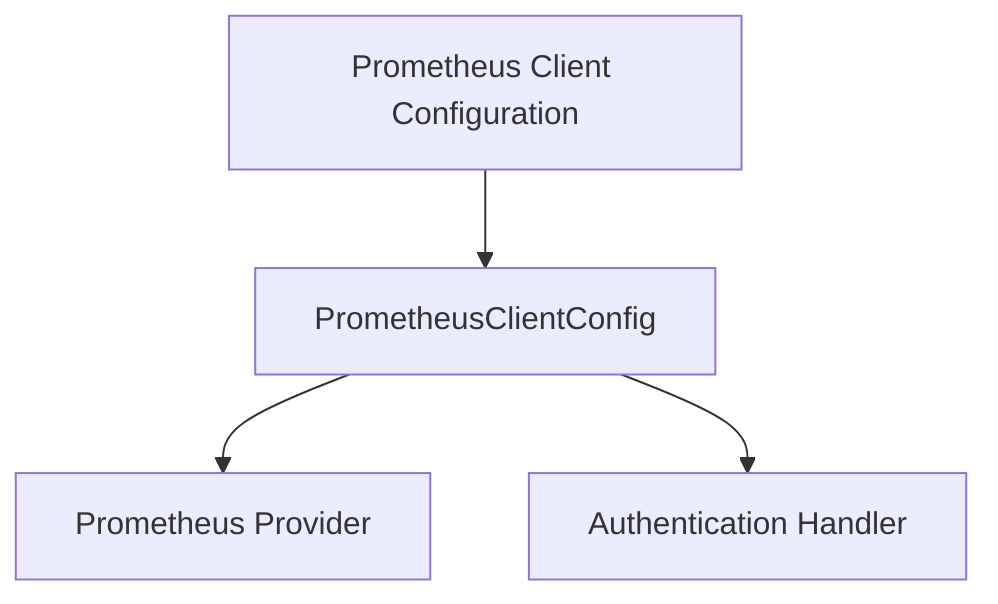

# client_configuration_details Module Documentation

The `client_configuration_details` module is a crucial component within the `metrics_provider_prometheus` ecosystem, specifically responsible for defining the configuration parameters required to connect to and interact with a Prometheus server. It encapsulates all necessary settings for establishing a robust and authenticated connection, including network details, timeouts, and authentication tokens.

### Purpose and Core Functionality

The primary purpose of `client_configuration_details` is to centralize and standardize the configuration for Prometheus client connections. Its core functionality revolves around the `PrometheusClientConfig` structure, which provides a comprehensive set of fields for:

*   **Prometheus Server Connection:** Specifying the `PrometheusURL` and various network-related parameters like `QueryTimeout`, `MaxConnsPerHost`, `MaxIdleConns`, `IdleConnTimeout`, `ResponseTimeout`, `DialTimeout`, `KeepAlive`, and `TLSHandshakeTimeout`. These settings ensure efficient and reliable communication with the Prometheus server.
*   **Authentication:** Including a `BearerToken` field for secure authentication with the Prometheus instance.
*   **Query Execution:** Configuring parameters for the Prometheus provider itself, such as `MaxQueryRetries`, `RetryBackoffBase`, and `MaxConcurrentQueries`, which govern how queries are executed and retried.

By consolidating these settings, the module ensures that all components requiring Prometheus access can leverage a consistent and well-defined configuration.

### Architecture and Component Relationships

The `client_configuration_details` module is a leaf module within the `prometheus_client_configuration` module. Its core component, `PrometheusClientConfig`, is a data structure that serves as a blueprint for configuring Prometheus clients.

<!-- DIAGRAM_JSON
{
    "direction": "TD",
    "nodes": [
        {"id": "prometheus_client_config_struct", "label": "PrometheusClientConfig", "type": "component", "link": null},
        {"id": "prometheus_provider_module", "label": "Prometheus Provider", "type": "external", "link": "prometheus_provider.md"},
        {"id": "authentication_handler_module", "label": "Authentication Handler", "type": "external", "link": "authentication_handler.md"},
        {"id": "prometheus_client_configuration_module", "label": "Prometheus Client Configuration", "type": "external", "link": "prometheus_client_configuration.md"}
    ],
    "edges": [
        {"source": "prometheus_client_configuration_module", "target": "prometheus_client_config_struct"},
        {"source": "prometheus_client_config_struct", "target": "prometheus_provider_module"},
        {"source": "prometheus_client_config_struct", "target": "authentication_handler_module"}
    ],
    "groups": []
}
-->

**Relationships:**

*   **`prometheus_client_configuration_module`**: This is the parent module that defines and manages the Prometheus client configuration, making `PrometheusClientConfig` a central part of its definition.
*   **`prometheus_provider_module` ([prometheus_provider.md](prometheus_provider.md))**: The `PrometheusProvider` component in the `prometheus_provider` module will consume the `PrometheusClientConfig` to establish its connection and query parameters for interacting with Prometheus.
*   **`authentication_handler_module` ([authentication_handler.md](authentication_handler.md))**: The `BearerTokenRoundTripper` within the `authentication_handler` module likely utilizes the `BearerToken` field from `PrometheusClientConfig` to add authentication headers to HTTP requests made to Prometheus.

### How the Module Fits into the Overall System

The `client_configuration_details` module acts as a foundational configuration layer for all Prometheus-related interactions within the system. It is a critical dependency for the `prometheus_client_adapter` ([prometheus_client_adapter.md](prometheus_client_adapter.md)), which in turn is a key part of the broader `metrics_provider_prometheus` ([metrics_provider_prometheus.md](metrics_provider_prometheus.md)) system.

Any component that needs to connect to or query Prometheus will ultimately rely on the configuration defined within this module. This ensures consistency, simplifies maintenance, and provides a single point of control for managing Prometheus client settings across the application. For instance, tasks requiring metric fetching or node load monitoring will indirectly depend on this configuration to retrieve data from Prometheus effectively.