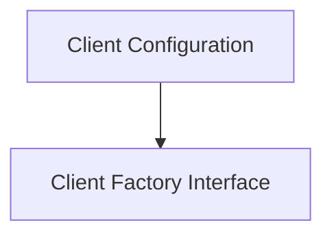

# Client Factories Module

## Introduction
The `client_factories` module provides the foundational structures for configuring and creating database client instances. It defines a common interface for database client factories and a configuration schema that supports various database types like SQLite and PostgreSQL.

## Architecture
This module is composed of two primary sub-modules:
- **Client Configuration**: Defines the parameters required to establish database connections.
- **Client Factory Interface**: Specifies the contract for creating concrete database client implementations.

These components work together to ensure a flexible and extensible approach to database client instantiation.

<!-- DIAGRAM_JSON
{
    "direction": "TD",
    "nodes": [
        {"id": "client_configuration", "label": "Client Configuration", "type": "module", "link": "client_configuration.md"},
        {"id": "client_interface", "label": "Client Factory Interface", "type": "module", "link": "client_interface.md"}
    ],
    "edges": [
        {"source": "client_configuration", "target": "client_interface"}
    ],
    "groups": []
}
-->

## Sub-modules

### [Client Configuration](client_configuration.md)
This sub-module (`client_configuration`) is responsible for defining the `FactoryConfig` structure. This configuration includes essential details such as the database type, host, port, database name, username, password, and SSL mode, enabling the system to connect to different database providers.

### [Client Factory Interface](client_interface.md)
This sub-module (`client_interface`) introduces the `ClientFactory` interface. It provides a standardized method, `CreateClient()`, for producing configured database client instances, abstracting the specific implementation details of different database systems (e.g., PostgreSQL, SQLite) from the calling code.

