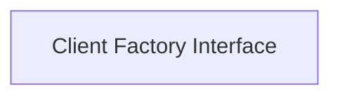

<!-- AUTO_GENERATED_PLACEHOLDER
  reason: LLM did not create .md file for this module
  module_path: database_adapters/database_clients/client_factories/client_interface
  component_count: 1
  generated_at: 2026-02-03T14:34:07.348092
  TODO: Fix LLM prompt to handle small leaf modules
-->

# Client Factory Interface

> ⚠️ **Auto-Generated Placeholder**
> This documentation was auto-generated because the LLM failed to create it.
> Module path: `database_adapters/database_clients/client_factories/client_interface`

Provides an interface for creating database client instances, abstracting the underlying database implementation.

## Components

This module contains 1 component(s):

- `pkg.adapters.database.clients.clients.ClientFactory`

## Structure

---
*Auto-generated placeholder. See sync_issues.json for details.*
