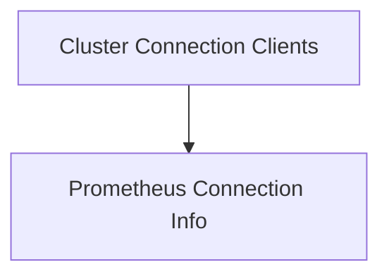

# Cluster Clients Module

## Introduction
The `cluster_clients` module is a crucial component within the `cluster_management` module, responsible for consolidating and managing client connections to various services within a Kubernetes cluster. It provides a unified structure to access Kubernetes API, dynamic client functionalities, and Prometheus metrics, along with the necessary connection information for Prometheus.

## Architecture Overview
The `cluster_clients` module consists of two main sub-modules:
- `cluster_connection_clients`: Manages the actual client instances for Kubernetes and Prometheus.
- `prometheus_connection_info`: Stores the configuration details required to establish a connection with Prometheus.

These sub-modules work together to ensure that the broader `cluster_management` module has all the necessary tools and information to interact with and monitor a Kubernetes cluster effectively.

<!-- DIAGRAM_JSON
{
    "direction": "TD",
    "nodes": [
        {"id": "cluster_connection_clients", "label": "Cluster Connection Clients", "type": "module", "link": "cluster_connection_clients.md"},
        {"id": "prometheus_connection_info", "label": "Prometheus Connection Info", "type": "module", "link": "prometheus_connection_info.md"}
    ],
    "edges": [
        {"source": "cluster_connection_clients", "target": "prometheus_connection_info"}
    ],
    "groups": []
}
-->

## Sub-modules

### [Cluster Connection Clients](cluster_connection_clients.md)
This sub-module encapsulates the various client instances (Kubernetes API client, dynamic client, Prometheus API client) that are used to interact with a specific Kubernetes cluster. It provides a centralized object for managing all cluster-specific client connections.

### [Prometheus Connection Info](prometheus_connection_info.md)
This sub-module defines the structure for storing the necessary connection details for a Prometheus instance associated with a cluster. It includes the Prometheus URL and any required authentication tokens, enabling the system to query metrics from Prometheus.
