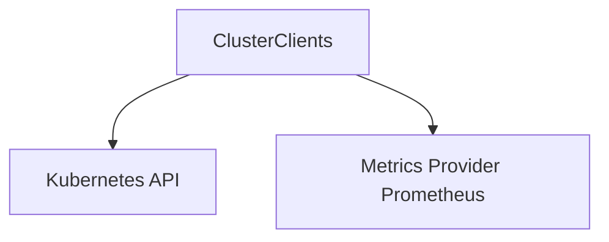

# cluster_connection_clients Module Documentation

## Introduction

The `cluster_connection_clients` module is a fundamental component within the `cluster_management` system, specifically residing under `cluster_clients`. Its primary purpose is to consolidate and manage the various client connections necessary to interact with a Kubernetes cluster and its associated monitoring infrastructure, such as Prometheus. This module provides a single, cohesive structure to access Kubernetes API clients and Prometheus API clients, along with essential cluster identification and health status.

## Core Functionality

The `cluster_connection_clients` module's core functionality is encapsulated in the `ClusterClients` struct. This struct acts as a central repository for all critical client interfaces required for cluster operations and metric collection.

### ClusterClients

The `ClusterClients` struct defines the following fields:

*   **KubeClient**: A Kubernetes `Clientset` that provides a complete client for all versions of the Kubernetes API. It enables interaction with Kubernetes resources like Pods, Deployments, Services, etc.
*   **DynamicClient**: An interface for dynamic client operations, allowing interaction with arbitrary Kubernetes API objects without compile-time knowledge of their Go types. This is particularly useful for custom resources or flexible resource management.
*   **PrometheusClient**: A Prometheus `v1.API` client, used for querying metrics from a Prometheus server. This client facilitates the retrieval of time-series data crucial for monitoring and analysis. For more details on Prometheus integration, refer to the [metrics_provider_prometheus.md](metrics_provider_prometheus.md) documentation.
*   **ClusterID**: A unique string identifier for the Kubernetes cluster being managed.
*   **Healthy**: A boolean flag indicating the current health status of the cluster connections.

## Architecture and Component Relationships

The `cluster_connection_clients` module primarily centers around the `ClusterClients` component, which establishes and holds connections to external services. It acts as a bridge between the internal cluster management logic and the external Kubernetes and Prometheus APIs.

<!-- DIAGRAM_JSON
{
    "direction": "TD",
    "nodes": [
        {"id": "cluster_clients_component", "label": "ClusterClients", "type": "component", "link": null},
        {"id": "kubernetes_api", "label": "Kubernetes API", "type": "external", "link": null},
        {"id": "metrics_provider_prometheus", "label": "Metrics Provider Prometheus", "type": "external", "link": "metrics_provider_prometheus.md"}
    ],
    "edges": [
        {"source": "cluster_clients_component", "target": "kubernetes_api"},
        {"source": "cluster_clients_component", "target": "metrics_provider_prometheus"}
    ],
    "groups": []
}
-->

## How the Module Fits into the Overall System

This module is a leaf component within the `cluster_clients` module, which in turn is part of the broader `cluster_management` system. It provides the essential communication channels for other modules that need to interact with Kubernetes clusters or retrieve metrics from Prometheus. For instance, components responsible for scheduling, task execution, or performance monitoring would utilize the `ClusterClients` to perform their operations. Its consolidated nature simplifies dependency management and ensures consistent access to cluster resources.

For an overview of how `ClusterClients` is used within the `cluster_management` module, refer to [cluster_management.md](cluster_management.md).
