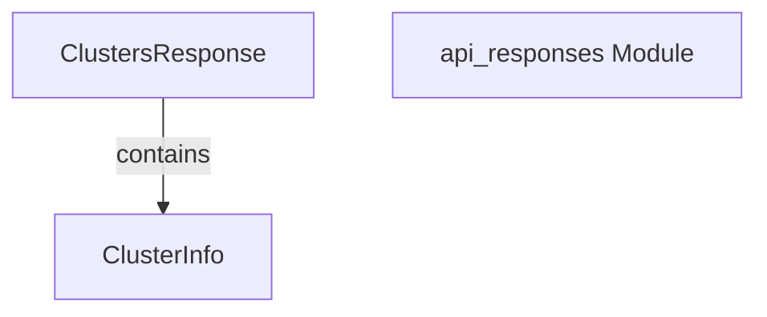

# cluster_data_models

The `cluster_data_models` module provides the essential data structures for representing cluster-related information received from the recommender service API. It ensures a consistent and well-defined format for API responses concerning clusters, facilitating smooth data exchange between the client and the recommender service.

### Core Functionality

This module primarily defines two critical data models:

-   **`ClustersResponse`**: This structure encapsulates the entire response when querying for a list of clusters. It includes the actual list of `ClusterInfo` objects, the total count of clusters, and the operational cluster mode.
-   **`ClusterInfo`**: This structure details individual cluster properties, such as a unique identifier (`ID`), its human-readable `Name`, and a boolean flag indicating `StatsAvailable` for that cluster.

### Architecture and Component Relationships

The `cluster_data_models` module is a focused component within the broader `api_data_models` family, specifically handling data structures for cluster-related API responses. Its components are tightly coupled: `ClustersResponse` directly incorporates a slice of `ClusterInfo` objects, establishing a clear containment relationship.

<!-- DIAGRAM_JSON
{
    "direction": "TD",
    "nodes": [
        {"id": "ClustersResponse", "label": "ClustersResponse", "type": "component", "link": null},
        {"id": "ClusterInfo", "label": "ClusterInfo", "type": "component", "link": null},
        {"id": "api_responses", "label": "api_responses Module", "type": "external", "link": "api_responses.md"}
    ],
    "edges": [
        {"source": "ClustersResponse", "target": "ClusterInfo", "label": "contains"}
    ],
    "groups": []
}
-->

### How it Fits into the Overall System

This module plays a crucial role in the client-side interaction with the recommender service. As a sub-module of `api_responses` and subsequently `api_data_models`, its defined structures are fundamental for the `recommender_client` to correctly interpret and process API responses related to cluster information. Any component or service that needs to consume cluster data from the recommender API will rely on these data models for consistent parsing and usage. It directly supports the overall goal of providing a structured and reliable interface for managing and understanding cluster states within the system.
