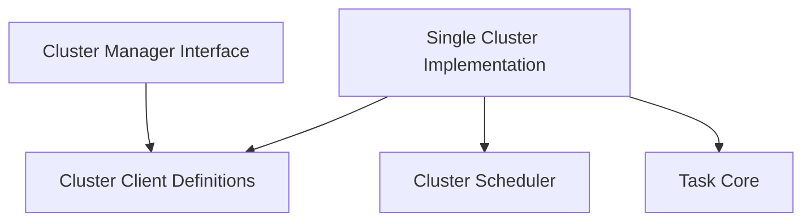

# Cluster Management Module

## Introduction

The `cluster_management` module is responsible for orchestrating interactions with multiple Kubernetes clusters. It provides an interface for managing cluster clients, fetching cluster information, and scheduling tasks across these clusters. This module acts as a central hub for maintaining the operational state and performing actions on connected clusters, integrating with Kubernetes API clients, Prometheus, and an internal task scheduler.

## Architecture Overview

The `cluster_management` module is composed of several key sub-modules that work together to provide comprehensive cluster interaction capabilities. The `cluster_manager_interface` defines the contract for cluster operations, while `cluster_clients` encapsulates the necessary API connections for each managed cluster. The `single_cluster_manager` provides a concrete implementation for handling the lifecycle and task scheduling within individual clusters, leveraging components from the `cluster_scheduler` and `task_core` modules.

<!-- DIAGRAM_JSON
{
    "direction": "TD",
    "nodes": [
        {"id": "cluster_clients", "label": "Cluster Client Definitions", "type": "module", "link": "cluster_clients.md"},
        {"id": "cluster_manager_interface", "label": "Cluster Manager Interface", "type": "module", "link": "cluster_manager_interface.md"},
        {"id": "single_cluster_manager", "label": "Single Cluster Implementation", "type": "module", "link": "single_cluster_manager.md"},
        {"id": "cluster_scheduler", "label": "Cluster Scheduler", "type": "external", "link": "cluster_scheduler.md"},
        {"id": "task_core", "label": "Task Core", "type": "external", "link": "task_core.md"}
    ],
    "edges": [
        {"source": "cluster_manager_interface", "target": "cluster_clients"},
        {"source": "single_cluster_manager", "target": "cluster_clients"},
        {"source": "single_cluster_manager", "target": "cluster_scheduler"},
        {"source": "single_cluster_manager", "target": "task_core"}
    ],
    "groups": []
}
-->

## Sub-modules

### [Cluster Client Definitions](cluster_clients.md)
This sub-module defines the structures for managing various client connections to a Kubernetes cluster, including Kubernetes API clients, dynamic clients, and Prometheus clients, along with essential cluster identification and health status. It also includes the structure for Prometheus connection information.

### [Cluster Manager Interface](cluster_manager_interface.md)
This sub-module outlines the `Manager` interface, which provides a contract for high-level cluster management operations. These operations include refreshing cluster states, retrieving comprehensive cluster details, obtaining Prometheus connection information, and managing the scheduling and execution of various tasks across managed clusters.

### [Single Cluster Implementation](single_cluster_manager.md)
The `single_cluster_manager` sub-module provides a concrete implementation of a cluster manager focused on a single Kubernetes cluster. It integrates the client connections, manages a dedicated scheduler for cluster-specific tasks, and registers tasks that can be executed within that cluster. This implementation is crucial for orchestrating operations in individual cluster environments.