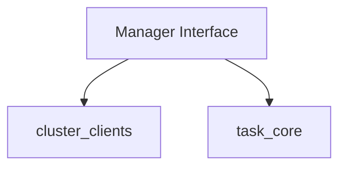

# cluster_manager_interface

The `cluster_manager_interface` module defines the core interface for managing and interacting with multiple Kubernetes clusters within the system. It establishes a contract for operations related to cluster lifecycle, client access, Prometheus connectivity, and task scheduling across these clusters.

## Purpose and Core Functionality

The primary purpose of the `Manager` interface is to provide an abstract layer for handling multi-cluster operations. It ensures that various parts of the system can interact with the cluster management logic in a standardized way, without needing to know the concrete implementation details.

Key functionalities provided by this interface include:

-   **Cluster Refreshment:** Ability to refresh the list and status of managed clusters.
-   **Cluster Access:** Methods to retrieve clients for specific clusters and access all currently managed clusters.
-   **Prometheus Integration:** Providing connection information for Prometheus instances associated with each cluster.
-   **Task Management:** Integration with the task scheduling system, allowing tasks to be added, retrieved, and scheduled across the managed clusters.

## Architecture and Component Relationships

The `Manager` interface defines the interaction points with underlying cluster management logic. Its methods imply dependencies on components that provide cluster client functionalities and task definitions.

<!-- DIAGRAM_JSON
{
    "direction": "TD",
    "nodes": [
        {"id": "manager_interface", "label": "Manager Interface", "type": "component", "link": null},
        {"id": "cluster_clients_module", "label": "cluster_clients", "type": "external", "link": "cluster_clients.md"},
        {"id": "task_core_module", "label": "task_core", "type": "external", "link": "task_core.md"}
    ],
    "edges": [
        {"source": "manager_interface", "target": "cluster_clients_module"},
        {"source": "manager_interface", "target": "task_core_module"}
    ],
    "groups": []
}
-->


**Component Description:**

*   **Manager Interface (`pkg.cluster.manager.Manager`):** This is the central component of this module. It defines a set of methods that any concrete cluster manager implementation must provide. These methods cover operations like refreshing cluster information, retrieving `ClusterClients` objects, accessing `PrometheusConnectionInfo`, and managing `task.Task` instances.

**Relationships:**

*   The `Manager` interface directly references `*ClusterClients` and `*PrometheusConnectionInfo` in its method signatures, indicating a strong dependency on the `cluster_clients` module. A concrete implementation of this interface would utilize components from `cluster_clients` to manage individual cluster connections.
*   The `Manager` interface includes methods for `AddTask` and `GetTask` which operate on `task.Task` objects. This highlights its dependency on the `task_core` module, which defines the fundamental `Task` interface.

## How the Module Fits into the Overall System

The `cluster_manager_interface` module serves as a crucial abstraction layer within the system's overall architecture. It enables a clean separation of concerns, allowing higher-level modules to manage and interact with clusters without being tightly coupled to a specific cluster management implementation.

It is particularly relevant for:

*   **Cluster Management (`cluster_management`):** This module's parent, `cluster_management`, would contain concrete implementations of the `Manager` interface, such as `single_cluster_manager` or a multi-cluster orchestrator.
*   **Task Scheduling (`cluster_scheduler`):** Modules responsible for scheduling and executing tasks across clusters would depend on this interface to get cluster clients and schedule tasks.
*   **Recommendation Engine (`recommender_client`):** Any module interacting with a recommender service that requires cluster-specific information or needs to apply recommendations would likely use the `Manager` interface to access the relevant cluster.
*   **API Handlers (`api_handlers`):** If the system exposes APIs for cluster management or task triggering, these handlers would interact with the `Manager` interface.

By providing a well-defined interface, `cluster_manager_interface` ensures extensibility and maintainability, allowing new cluster types or management strategies to be integrated seamlessly into the system.

```go
package cluster_manager_interface

import (
	"context"

	"github.com/your-org/your-repo/pkg/cluster/manager"
	"github.com/your-org/your-repo/pkg/task"
)

// Manager defines the interface for managing multiple clusters.
type Manager interface {
	RefreshClusters(ctx context.Context) error
	GetAllClusters() map[string]*manager.ClusterClients
	GetClusterIDs() []string
	GetClusterClients(clusterID string) (*manager.ClusterClients, error)
	GetPrometheusConnectionInfo(clusterID string) (*manager.PrometheusConnectionInfo, error)
	GetClusterMode() manager.ClusterMode
	AddTask(task task.Task)
	GetTask(taskName string) (task.Task, error)
	ScheduleAllTasks() error
}
```