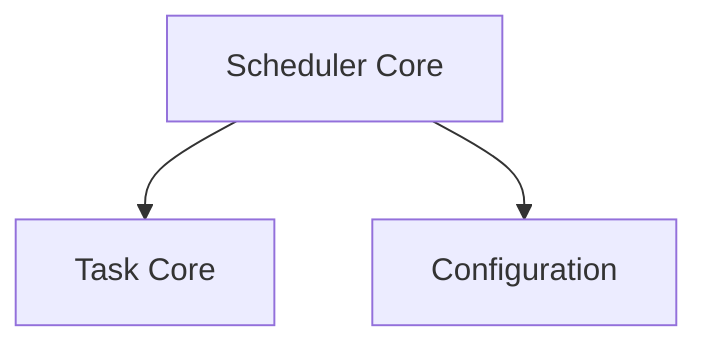

# Cluster Scheduler Module

## Introduction
The `cluster_scheduler` module is central to managing and executing various periodic and event-driven tasks across the cluster. It provides the fundamental mechanisms for task registration, scheduling, and concurrent execution, ensuring that critical operations are performed efficiently and reliably.

## Architecture Overview
The `cluster_scheduler` module is designed to be a robust task orchestration layer. It relies on a core scheduler component that manages a collection of scheduled tasks. Each task is encapsulated with its timing and execution logic. The scheduler interacts with the `task_core` module to understand task definitions and leverages the `configuration` module for its operational settings and dependencies.

<!-- DIAGRAM_JSON
{
    "direction": "TD",
    "nodes": [
        {"id": "scheduler_core", "label": "Scheduler Core", "type": "module", "link": "scheduler_core.md"},
        {"id": "task_core", "label": "Task Core", "type": "external", "link": "task_core.md"},
        {"id": "configuration", "label": "Configuration", "type": "external", "link": "configuration.md"}
    ],
    "edges": [
        {"source": "scheduler_core", "target": "task_core"},
        {"source": "scheduler_core", "target": "configuration"}
    ],
    "groups": []
}
-->

## High-Level Functionality

### Scheduler Core ([scheduler_core.md](scheduler_core.md))
This sub-module is responsible for the core scheduling logic. It defines the `Scheduler` component, which manages the lifecycle of tasks, including their registration, starting, stopping, and concurrent execution. It also defines `taskEntry`, which encapsulates the state and control mechanisms for individual scheduled tasks.
