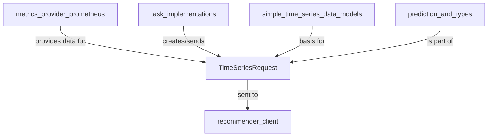

# complex_time_series_requests Module Documentation

## Introduction

The `complex_time_series_requests` module defines the data structures used for making complex time series prediction requests within the system. Its primary role is to encapsulate the necessary information, including historical time series data and the desired forecast horizon, for requesting predictions from an external prediction service.

## Architecture and Component Relationships

The module's core component is `TimeSeriesRequest`, which facilitates the structured communication for time series forecasting. It builds upon simpler time series data models and is utilized by various tasks that require predictive analytics.

<!-- DIAGRAM_JSON
{
    "direction": "TD",
    "nodes": [
        {"id": "time_series_request", "label": "TimeSeriesRequest", "type": "component", "link": null},
        {"id": "simple_time_series_data_models", "label": "simple_time_series_data_models", "type": "external", "link": "simple_time_series_data_models.md"},
        {"id": "prediction_and_types", "label": "prediction_and_types", "type": "external", "link": "prediction_and_types.md"},
        {"id": "recommender_client", "label": "recommender_client", "type": "external", "link": "recommender_client.md"},
        {"id": "metrics_provider_prometheus", "label": "metrics_provider_prometheus", "type": "external", "link": "metrics_provider_prometheus.md"},
        {"id": "task_implementations", "label": "task_implementations", "type": "external", "link": "task_implementations.md"}
    ],
    "edges": [
        {"source": "metrics_provider_prometheus", "target": "time_series_request", "label": "provides data for"},
        {"source": "task_implementations", "target": "time_series_request", "label": "creates/sends"},
        {"source": "time_series_request", "target": "recommender_client", "label": "sent to"},
        {"source": "simple_time_series_data_models", "target": "time_series_request", "label": "basis for"},
        {"source": "prediction_and_types", "target": "time_series_request", "label": "is part of"}
    ],
    "groups": []
}
-->


### Core Components

#### `TimeSeriesRequest`
```go
type TimeSeriesRequest struct {
	TimeSeriesData  []map[string][]float64 `json:"timeseries_data"`
	ForecastHorizon int                    `json:"forecast_horizon"`
}
```
This struct defines a request for time series prediction.
- `TimeSeriesData`: A slice of maps, where each map likely represents a time point or series, containing metrics (e.g., CPU, memory) as `float64` values.
- `ForecastHorizon`: An integer specifying how many future steps (e.g., minutes, hours) the prediction should cover.

## How the Module Fits into the Overall System

The `complex_time_series_requests` module serves as a fundamental building block for any system component requiring advanced time series forecasting. It enables:

*   **Proactive Resource Management**: Tasks within the [task_implementations](task_implementations.md) module can leverage `TimeSeriesRequest` to predict future resource demands (e.g., CPU, memory) for workloads. This allows for intelligent scaling and resource allocation.
*   **Recommendation Generation**: The module forms the input for prediction services, potentially managed by the [recommender_client](recommender_client.md). These services consume `TimeSeriesRequest` to generate recommendations for optimizing resource usage.
*   **Data Integration**: It provides a standardized format for historical data, which is typically sourced from metrics providers such as [metrics_provider_prometheus](metrics_provider_prometheus.md), ensuring consistency when interacting with prediction models.
*   **Foundation for Prediction Logic**: As part of the broader [prediction_and_types](prediction_and_types.md) module, it contributes to a comprehensive set of data types and utilities for time series analysis and prediction. It is also conceptually linked to [simple_time_series_data_models](simple_time_series_data_models.md) which may define simpler underlying data structures.
