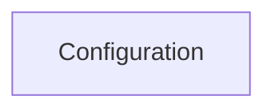

<!-- AUTO_GENERATED_PLACEHOLDER
  reason: LLM did not create .md file for this module
  module_path: configuration
  component_count: 14
  generated_at: 2026-02-03T14:34:07.348610
  TODO: Fix LLM prompt to handle small leaf modules
-->

# Configuration

> ⚠️ **Auto-Generated Placeholder**
> This documentation was auto-generated because the LLM failed to create it.
> Module path: `configuration`

Provides 14 component(s) for configuration operations.

## Components

This module contains 14 component(s):

- `pkg.config.config.ServerConfig`
- `pkg.config.config.BasicAuthConfig`
- `pkg.config.config.TelemetryConfig`
- `pkg.config.config.DatabaseConfig`
- `pkg.config.config.ControllerConfig`
- `pkg.config.config.URLConfig`
- `pkg.config.config.LocalDeps`
- `pkg.config.config.InClusterDeps`
- `pkg.config.config.MetricsConfig`
- `pkg.config.config.RecommendationSettings`
- ... and 4 more

## Structure

---
*Auto-generated placeholder. See sync_issues.json for details.*
