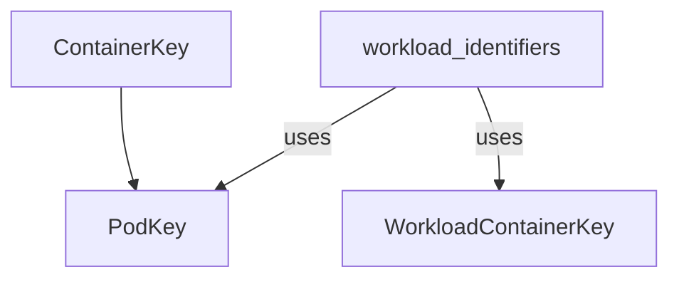

# Container Identifiers Module

## Introduction

The `container_identifiers` module provides fundamental data structures for uniquely identifying pods and containers within a Kubernetes cluster. These identifiers are crucial for various operations, including monitoring, resource management, and applying recommendations at both the pod and workload levels. This module is a sub-component of the [workload_and_container_identifiers](workload_and_container_identifiers.md) module, which in turn is part of the broader [prediction_and_types](prediction_and_types.md) and [task_utilities](task_utilities.md) functionality.

## Core Functionality

This module defines three primary structs:

### `PodKey`

Identifies a specific pod using its namespace and name. This is a foundational identifier for any pod-level operation.

```go
type PodKey struct {
	Namespace string
	PodName   string
}
```

### `ContainerKey`

Identifies a specific container running within a pod. It extends `PodKey` by adding the container's name, allowing for precise targeting of individual containers.

```go
type ContainerKey struct {
	Namespace     string
	PodName       string
	ContainerName string
}
```

### `WorkloadContainerKey`

Identifies a container as part of a higher-level workload (e.g., Deployment, StatefulSet, DaemonSet). This key includes the workload's kind, namespace, name, and the container's name within that workload. It's used when operations need to apply across all instances of a container defined by a workload, rather than a single pod instance.

```go
type WorkloadContainerKey struct {
	Kind          string
	Namespace     string
	Name          string
	ContainerName string
}
```

## Architecture and Component Relationships

The `container_identifiers` module provides basic building blocks for identifying containers and pods. `ContainerKey` logically extends `PodKey` by adding container-specific information. `WorkloadContainerKey` offers an alternative identification scheme focused on the workload definition rather than individual pod instances.

<!-- DIAGRAM_JSON
{
    "direction": "TD",
    "nodes": [
        {"id": "pod_key", "label": "PodKey", "type": "component", "link": null},
        {"id": "container_key", "label": "ContainerKey", "type": "component", "link": null},
        {"id": "workload_container_key", "label": "WorkloadContainerKey", "type": "component", "link": null},
        {"id": "workload_identifiers", "label": "workload_identifiers", "type": "external", "link": "workload_identifiers.md"}
    ],
    "edges": [
        {"source": "container_key", "target": "pod_key"}
    ],
    "groups": []
}
-->


## How the Module Fits into the Overall System

This module serves as a foundational component for identifying and referencing specific containers and pods throughout the system. It is heavily utilized by:

*   **[task_utilities](task_utilities.md)**: For various tasks requiring precise targeting of resources, such as fetching metrics or applying recommendations.
*   **[prediction_and_types](prediction_and_types.md)**: To define the scope of predictions (e.g., predicting resource usage for a specific container).
*   **[workload_and_container_identifiers](workload_and_container_identifiers.md)**: As a core part of the overall identification scheme, complementing [workload_identifiers](workload_identifiers.md).

By providing clear and consistent identification mechanisms, `container_identifiers` ensures that operations can accurately pinpoint and manage resources at the granular level required for efficient Kubernetes cluster optimization.