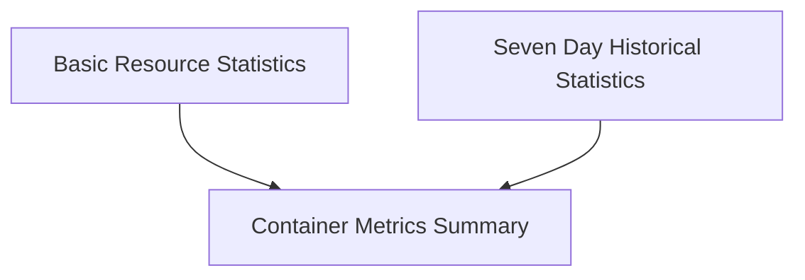

# Container Metrics Module

## Introduction

The `container_metrics` module defines the core data structures used to store and manage various performance and resource utilization metrics for individual containers. These metrics are crucial for monitoring, analysis, and driving optimization recommendations within the system.

## Architecture Overview

The module's architecture revolves around a central `ContainerStats` structure, which aggregates different types of container-level metrics. These include basic resource utilization, historical 7-day trends, and potentially machine learning-driven predictions. The module provides a standardized way to represent this comprehensive set of container data.

<!-- DIAGRAM_JSON
{
    "direction": "TD",
    "nodes": [
        {"id": "container_metrics_summary", "label": "Container Metrics Summary", "type": "module", "link": "container_metrics_summary.md"},
        {"id": "basic_resource_stats", "label": "Basic Resource Statistics", "type": "module", "link": "basic_resource_stats.md"},
        {"id": "seven_day_stats", "label": "Seven Day Historical Statistics", "type": "module", "link": "seven_day_stats.md"}
    ],
    "edges": [
        {"source": "basic_resource_stats", "target": "container_metrics_summary"},
        {"source": "seven_day_stats", "target": "container_metrics_summary"}
    ],
    "groups": []
}
-->

## Sub-modules

### [Container Metrics Summary](container_metrics_summary.md)
This sub-module, represented by `pkg.types.stats.ContainerStats`, is the central data structure that consolidates all relevant metrics for a single container, including current usage, historical data, and predicted values.

### [Basic Resource Statistics](basic_resource_stats.md)
This sub-module defines the fundamental structures for immediate CPU (`pkg.types.stats.CPUStats`), Memory (`pkg.types.stats.MemoryStats`), and PSI adjusted usage (`pkg.types.stats.PSIAdjustedUsageStats`) statistics. These provide quick snapshots of resource consumption.

### [Seven Day Historical Statistics](seven_day_stats.md)
This sub-module encapsulates data types for tracking CPU (`pkg.types.stats.CPU7DayStats`) and Memory (`pkg.types.stats.Memory7DayStats`) usage over a 7-day period, offering insights into long-term trends and resource behavior.