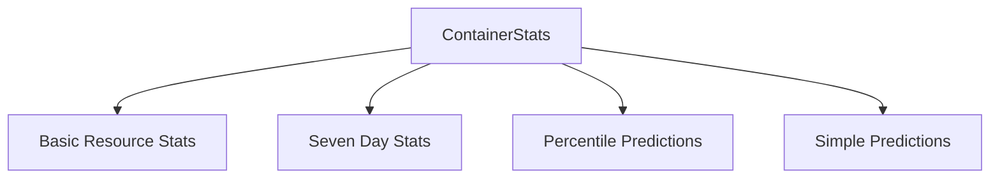

# container_metrics_summary

This module defines the `ContainerStats` structure, which serves as a comprehensive summary of various metrics and predictions for a single container within the system. It aggregates real-time, historical, and predicted resource utilization data.

## Core Functionality

The primary function of the `container_metrics_summary` module is to encapsulate all relevant statistical and predictive data for a container into a single, cohesive structure. This allows for a holistic view of a container's performance and resource requirements, facilitating analysis and recommendation generation.

## Architecture and Component Relationships

The `ContainerStats` component centralizes data from several other statistical and prediction-related modules. It acts as an aggregation point, bringing together basic resource metrics, 7-day historical trends, and machine learning-based predictions.

<!-- DIAGRAM_JSON
{
    "direction": "TD",
    "nodes": [
        {"id": "container_stats", "label": "ContainerStats", "type": "component", "link": null},
        {"id": "basic_resource_stats", "label": "Basic Resource Stats", "type": "external", "link": "basic_resource_stats.md"},
        {"id": "seven_day_stats", "label": "Seven Day Stats", "type": "external", "link": "seven_day_stats.md"},
        {"id": "percentile_predictions", "label": "Percentile Predictions", "type": "external", "link": "percentile_predictions.md"},
        {"id": "simple_predictions", "label": "Simple Predictions", "type": "external", "link": "simple_predictions.md"}
    ],
    "edges": [
        {"source": "container_stats", "target": "basic_resource_stats"},
        {"source": "container_stats", "target": "seven_day_stats"},
        {"source": "container_stats", "target": "percentile_predictions"},
        {"source": "container_stats", "target": "simple_predictions"}
    ],
    "groups": []
}
-->



## Component: `ContainerStats`

```go
type ContainerStats struct {
	ContainerName string        `json:"container_name"`
	ContainerType ContainerType `json:"container_type"`

	CPUStats         *CPUStats              `json:"cpu_stats"`
	PSIAdjustedUsage *PSIAdjustedUsageStats `json:"psi_adjusted_usage,omitempty"`

	MemoryStats *MemoryStats     `json:"memory_stats"`
	Memory7Day  *Memory7DayStats `json:"memory_7day"`
	CPU7Day     *CPU7DayStats    `json:"cpu_7day"`

	MLPercentilesCPU            *MLPercentilesCPU            `json:"ml_percentiles_cpu,omitempty"`
	MLPercentilesCPUPSIAdjusted *MLPercentilesCPUPSIAdjusted `json:"ml_percentiles_cpu_psi_adjusted,omitempty"`
	SimplePredictionsCPU        *SimplePrediction            `json:"simple_predictions_cpu,omitempty"`

	MLPercentilesMemory     *MLPercentilesMemory `json:"ml_percentiles_memory,omitempty"`
	SimplePredictionsMemory *SimplePrediction    `json:"simple_predictions_memory,omitempty"`
}
```

The `ContainerStats` struct provides a detailed summary of a container's resource usage and predictive analytics. Key fields include:

*   `ContainerName`: The name of the container.
*   `ContainerType`: The type of the container.
*   `CPUStats`: A pointer to [CPUStats](basic_resource_stats.md), providing current CPU usage statistics.
*   `PSIAdjustedUsage`: A pointer to [PSIAdjustedUsageStats](basic_resource_stats.md), offering CPU usage statistics adjusted for Pressure Stall Information.
*   `MemoryStats`: A pointer to [MemoryStats](basic_resource_stats.md), providing current memory usage statistics.
*   `Memory7Day`: A pointer to [Memory7DayStats](seven_day_stats.md), encapsulating memory usage statistics over a 7-day period.
*   `CPU7Day`: A pointer to [CPU7DayStats](seven_day_stats.md), encapsulating CPU usage statistics over a 7-day period.
*   `MLPercentilesCPU`: A pointer to [MLPercentilesCPU](percentile_predictions.md), containing machine learning-based percentile predictions for CPU.
*   `MLPercentilesCPUPSIAdjusted`: A pointer to [MLPercentilesCPUPSIAdjusted](percentile_predictions.md), containing machine learning-based percentile predictions for CPU adjusted by PSI.
*   `SimplePredictionsCPU`: A pointer to [SimplePrediction](simple_predictions.md), offering simpler CPU usage predictions.
*   `MLPercentilesMemory`: A pointer to [MLPercentilesMemory](percentile_predictions.md), containing machine learning-based percentile predictions for memory.
*   `SimplePredictionsMemory`: A pointer to [SimplePrediction](simple_predictions.md), offering simpler memory usage predictions.