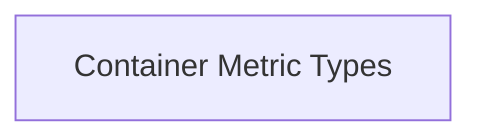

<!-- AUTO_GENERATED_PLACEHOLDER
  reason: LLM did not create .md file for this module
  module_path: task_utilities/metrics_utilities/container_metrics_data/container_metrics_types
  component_count: 2
  generated_at: 2026-02-03T14:34:07.350117
  TODO: Fix LLM prompt to handle small leaf modules
-->

# Container Metric Types

> ⚠️ **Auto-Generated Placeholder**
> This documentation was auto-generated because the LLM failed to create it.
> Module path: `task_utilities/metrics_utilities/container_metrics_data/container_metrics_types`

Defines data structures for storing and representing container-level CPU and memory metrics, including PSI-adjusted usage.

## Components

This module contains 2 component(s):

- `pkg.task.utils.metrics.ContainerMetrics`
- `pkg.task.utils.metrics.PSIAdjustedUsage`

## Structure

---
*Auto-generated placeholder. See sync_issues.json for details.*
