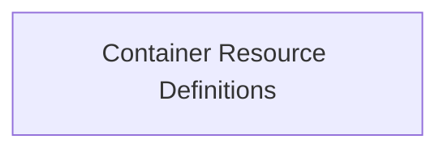

<!-- AUTO_GENERATED_PLACEHOLDER
  reason: LLM did not create .md file for this module
  module_path: data_types/stats_types/workload_statistics/container_resource_definitions
  component_count: 1
  generated_at: 2026-02-03T14:34:07.351288
  TODO: Fix LLM prompt to handle small leaf modules
-->

# Container Resource Definitions

> ⚠️ **Auto-Generated Placeholder**
> This documentation was auto-generated because the LLM failed to create it.
> Module path: `data_types/stats_types/workload_statistics/container_resource_definitions`

Details the original resource requests and limits for containers within a workload.

## Components

This module contains 1 component(s):

- `pkg.types.stats.OriginalContainerResources`

## Structure

---
*Auto-generated placeholder. See sync_issues.json for details.*
