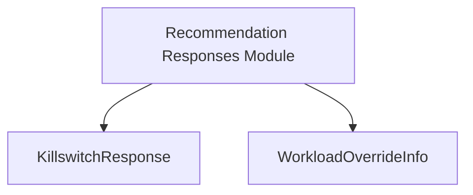

# control_plane_responses

The `control_plane_responses` module defines data structures for various responses related to control plane operations within the system. These structures facilitate communication and data exchange for actions such as killswitch functionality and workload overrides.

## Core Functionality

This module primarily provides two key data structures:

*   **`KillswitchResponse`**: This structure is used to convey the results of a killswitch operation. It provides detailed information about the outcome, including a message, whether the mutating webhook was deleted, the number of pods analyzed and killed, a list of killed pods, and any errors encountered during the process.

    ```go
type KillswitchResponse struct {
	Message                string   `json:"message"`
	DeletedMutatingWebhook bool     `json:"deleted_mutating_webhook"`
	PodsAnalyzed           int      `json:"pods_analyzed"`
	PodsKilled             int      `json:"pods_killed"`
	KilledPods             []string `json:"killed_pods"`
	Errors                 []string `json:"errors,omitempty"`
}
```

*   **`WorkloadOverrideInfo`**: This structure provides information about a specific workload's override settings. It includes identifiers for the workload, its name, namespace, kind, eviction ranking, and whether the override is currently enabled.

    ```go
type WorkloadOverrideInfo struct {
	WorkloadID      string          `json:"workload_id"`
	Name            string          `json:"name"`
	Namespace       string          `json:"namespace"`
	Kind            string          `json:"kind"`
	EvictionRanking EvictionRanking `json:"eviction_ranking"`	// Note: EvictionRanking is an external type, likely defined elsewhere.
	Enabled         bool            `json:"enabled"`
}
```

## Architecture and Component Relationships

The `control_plane_responses` module is a leaf module responsible for defining specific data transfer objects (DTOs) used in control plane interactions. It is a sub-module of the `recommendation_responses` module, indicating that these response types are primarily consumed or utilized within the context of recommendation-related control plane operations.

<!-- DIAGRAM_JSON
{
    "direction": "TD",
    "nodes": [
        {"id": "killswitch_response", "label": "KillswitchResponse", "type": "component", "link": null},
        {"id": "workload_override_info", "label": "WorkloadOverrideInfo", "type": "component", "link": null},
        {"id": "recommendation_responses", "label": "Recommendation Responses Module", "type": "external", "link": "recommendation_responses.md"}
    ],
    "edges": [
        {"source": "recommendation_responses", "target": "killswitch_response"},
        {"source": "recommendation_responses", "target": "workload_override_info"}
    ],
    "groups": []
}
-->

