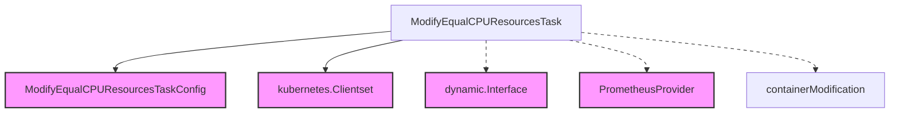

# CPU Resource Modification Module

## Introduction

The `cpu_resource_modification` module is a crucial component within the `task_implementations` suite, specifically designed to manage and modify CPU resources for containers within a Kubernetes cluster. This module implements the `ModifyEqualCPUResourcesTask`, which, as its name suggests, is responsible for adjusting CPU limits and requests for containers, ensuring optimized resource allocation based on predefined configurations or dynamic recommendations. It plays a vital role in maintaining cluster efficiency and preventing resource contention or underutilization.

## Architecture and Component Relationships

The `cpu_resource_modification` module primarily consists of the `ModifyEqualCPUResourcesTask` structure, which orchestrates the CPU resource modification process, and `containerModification`, a data structure defining the specifics of a container's CPU adjustment.

### Core Components

*   **`ModifyEqualCPUResourcesTask`**: This is the main task structure that encapsulates the logic for modifying CPU resources. It holds references to necessary clients and configurations to interact with the Kubernetes API and Prometheus for metric gathering.
*   **`containerModification`**: A data structure used to specify the name of a container and its new CPU limit in millicores. This structure guides the modification process performed by the task.

### Dependencies

The `ModifyEqualCPUResourcesTask` relies on several external components and other modules to perform its operations:

*   **Configuration**: It depends on `ModifyEqualCPUResourcesTaskConfig` (from the `task_configuration` module) to get its operational parameters, such as the target containers or modification strategies.
*   **Kubernetes Clients**: It utilizes `kubernetes.Clientset` for standard Kubernetes API interactions and `dynamic.Interface` for more flexible resource manipulation, allowing it to apply changes to various workload types.
*   **Metrics Provider**: It uses `prometheus.PrometheusProvider` (from the [metrics_provider_prometheus.md](metrics_provider_prometheus.md) module) to potentially fetch metrics that might inform or validate the CPU resource modifications.

## System Integration

This module is part of the broader `task_implementations` family, specifically nested under `resource_modification_tasks` and `task_execution`. It represents a concrete implementation of a task that can be scheduled and executed by the `cluster_scheduler` module. Its function is to take a predefined configuration (or potentially recommendations generated by other parts of the system) and translate that into actual resource adjustments within the Kubernetes cluster. It contributes to the system's ability to react to changing workload demands and maintain optimal resource utilization.

## Diagram

<!-- DIAGRAM_JSON
{
    "direction": "TD",
    "nodes": [
        {"id": "modify_equal_cpu_resources_task", "label": "ModifyEqualCPUResourcesTask", "type": "component", "link": null},
        {"id": "container_modification", "label": "containerModification", "type": "component", "link": null},
        {"id": "task_config", "label": "ModifyEqualCPUResourcesTaskConfig", "type": "external", "link": "task_configuration.md"},
        {"id": "kube_client", "label": "kubernetes.Clientset", "type": "external", "link": null},
        {"id": "dynamic_client", "label": "dynamic.Interface", "type": "external", "link": null},
        {"id": "prometheus_provider", "label": "PrometheusProvider", "type": "external", "link": "metrics_provider_prometheus.md"}
    ],
    "edges": [
        {"source": "modify_equal_cpu_resources_task", "target": "task_config"},
        {"source": "modify_equal_cpu_resources_task", "target": "kube_client"},
        {"source": "modify_equal_cpu_resources_task", "target": "dynamic_client"},
        {"source": "modify_equal_cpu_resources_task", "target": "prometheus_provider"},
        {"source": "modify_equal_cpu_resources_task", "target": "container_modification"}
    ],
    "groups": []
}
-->
