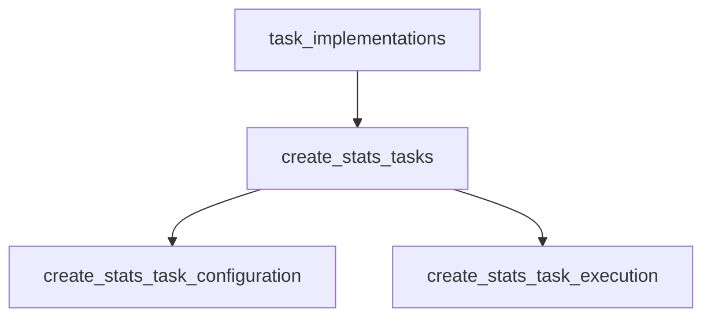

# create_stats_task_configuration Module Documentation

## Introduction and Purpose

The `create_stats_task_configuration` module is responsible for defining the structure and parameters required to configure the `CreateStatsTask`. This task is integral to the system's ability to generate and store statistical data, playing a crucial role in data analysis and monitoring. This module encapsulates the metadata and specific settings that govern how the statistics creation process operates, including scheduling, target clusters, and data lookback windows.

## Architecture Overview

The `create_stats_task_configuration` module is a sub-module of `create_stats_tasks`, which itself is part of the broader `task_implementations` module. It defines the structural elements for configuring the 'Create Stats' operation. It works in conjunction with `create_stats_task_execution`, which handles the actual execution of the task based on the configurations defined here.

<!-- DIAGRAM_JSON
{
    "direction": "TD",
    "nodes": [
        {"id": "task_implementations", "label": "task_implementations", "type": "module", "link": "task_implementations.md"},
        {"id": "create_stats_tasks", "label": "create_stats_tasks", "type": "module", "link": "create_stats_tasks.md"},
        {"id": "create_stats_task_configuration", "label": "create_stats_task_configuration", "type": "module", "link": "create_stats_task_configuration.md"},
        {"id": "create_stats_task_execution", "label": "create_stats_task_execution", "type": "module", "link": "create_stats_task_execution.md"}
    ],
    "edges": [
        {"source": "task_implementations", "target": "create_stats_tasks"},
        {"source": "create_stats_tasks", "target": "create_stats_task_configuration"},
        {"source": "create_stats_tasks", "target": "create_stats_task_execution"}
    ],
    "groups": []
}
-->


## Core Components

This module primarily defines two core components that dictate the behavior and parameters of the `CreateStatsTask`.

### CreateStatsMetadata

The `CreateStatsMetadata` struct provides task-specific metadata. Currently, it includes a flag to control whether memory-related statistics should be skipped during the stats generation process. This allows for flexible control over the data collected.

```go
type CreateStatsMetadata struct {
	SkipMemory bool `yaml:"skipMemory" json:"skipMemory" mapstructure:"skipMemory"`
}
```

### CreateStatsTaskConfig

The `CreateStatsTaskConfig` struct encapsulates all the configurable parameters for a `CreateStatsTask`. These parameters control various aspects of the task, from its name and scheduling to the specifics of data collection and processing.

- **Name**: A unique identifier for the task instance.
- **Enabled**: A boolean flag indicating whether the task is active.
- **Schedule**: A cron expression defining when the task should run.
- **ClusterID**: The ID of the cluster where the task is initiated.
- **TargetClusterID**: The ID of the target cluster from which statistics will be collected.
- **TargetNamespace**: The namespace within the target cluster to focus on for statistics collection.
- **RecentStatsLookbackMinutes**: Defines the duration (in minutes) for looking back at recent statistics data.
- **TimeStepSize**: The time interval between data points when collecting metrics.
- **MLLookbackWindow**: The duration for which machine learning models should look back when generating predictions or insights.
- **Metadata**: An embedded `CreateStatsMetadata` struct providing additional specific settings for the task.

```go
type CreateStatsTaskConfig struct {
	Name                       string
	Enabled                    bool
	Schedule                   string
	ClusterID                  string
	TargetClusterID            string
	TargetNamespace            string
	RecentStatsLookbackMinutes int
	TimeStepSize               time.Duration
	MLLookbackWindow           time.Duration
	Metadata                   CreateStatsMetadata
}
```
