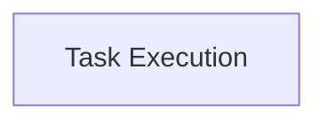

<!-- AUTO_GENERATED_PLACEHOLDER
  reason: LLM did not create .md file for this module
  module_path: task_implementations/create_stats_tasks/create_stats_task_execution
  component_count: 1
  generated_at: 2026-02-03T14:34:07.349710
  TODO: Fix LLM prompt to handle small leaf modules
-->

# Task Execution

> ⚠️ **Auto-Generated Placeholder**
> This documentation was auto-generated because the LLM failed to create it.
> Module path: `task_implementations/create_stats_tasks/create_stats_task_execution`

Implements the core logic and dependencies for the CreateStats task, responsible for orchestrating the collection and processing of statistics.

## Components

This module contains 1 component(s):

- `pkg.task.taskCreateStats.CreateStatsTask`

## Structure

---
*Auto-generated placeholder. See sync_issues.json for details.*
