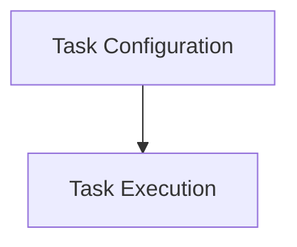

# Create Stats Tasks Module

## Introduction
The `create_stats_tasks` module is responsible for defining and executing tasks related to the creation of statistical data within the system. It encompasses the configuration, metadata, and the core task logic required to generate various statistics, which are crucial for monitoring, analysis, and potentially for feeding into recommendation engines.

This module integrates with Kubernetes clients, Prometheus for metrics, and a storage layer to gather and persist statistical information.

## Architecture Overview
The `create_stats_tasks` module is composed of two main sub-modules:

1.  **Task Configuration** (`create_stats_task_configuration.md`): Handles the structural definition and configurable parameters for the statistics creation task.
2.  **Task Execution** (`create_stats_task_execution.md`): Contains the implementation of the task itself, detailing how statistics are collected and processed.

<!-- DIAGRAM_JSON
{
    "direction": "TD",
    "nodes": [
        {"id": "create_stats_task_configuration", "label": "Task Configuration", "type": "module", "link": "create_stats_task_configuration.md"},
        {"id": "create_stats_task_execution", "label": "Task Execution", "type": "module", "link": "create_stats_task_execution.md"}
    ],
    "edges": [
        {"source": "create_stats_task_configuration", "target": "create_stats_task_execution"}
    ],
    "groups": []
}
-->

## Sub-modules

### Task Configuration
This sub-module, documented in [create_stats_task_configuration.md](create_stats_task_configuration.md), defines the `CreateStatsMetadata` and `CreateStatsTaskConfig` components. It sets up the parameters, scheduling, and target specifics for the statistics generation task.

### Task Execution
The [create_stats_task_execution.md](create_stats_task_execution.md) sub-module details the `CreateStatsTask` component. It outlines the operational aspects of the task, including its dependencies on Kubernetes, Prometheus, and the storage system, to perform the actual data collection and processing. It likely interacts with [metrics_provider_prometheus.md](metrics_provider_prometheus.md) for data fetching and [data_storage_repository.md](data_storage_repository.md) for persistence, and utilizes configurations from [configuration.md](configuration.md).