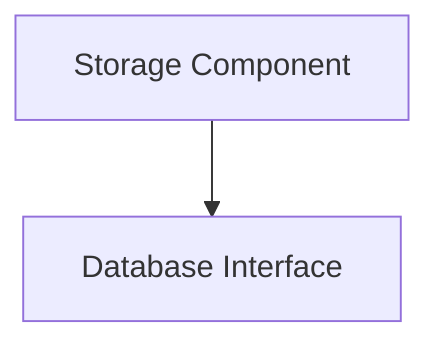

# data_storage_repository Module Documentation

## Introduction

The `data_storage_repository` module provides an abstraction layer for data persistence operations within the system. It encapsulates the underlying database interactions, offering a consistent interface for other modules to store and retrieve data. This module is crucial for maintaining data integrity and separating concerns related to data storage from the business logic.

## Architecture and Component Relationships

The `data_storage_repository` module primarily consists of the `Storage` component, which acts as the main entry point for database operations. It relies on the `Database` interface defined in the `application_ports` module to interact with various database implementations. This design promotes flexibility, allowing different database clients (e.g., PostgreSQL, SQLite) to be plugged in without affecting the `data_storage_repository` itself.

<!-- DIAGRAM_JSON
{
    "direction": "TD",
    "nodes": [
        {"id": "storage_component", "label": "Storage Component", "type": "component", "link": null},
        {"id": "database_port", "label": "Database Interface", "type": "external", "link": "application_ports.md"}
    ],
    "edges": [
        {"source": "storage_component", "target": "database_port"}
    ],
    "groups": []
}
-->



### Core Components

#### `Storage`
*   **Description**: The `Storage` struct is the concrete implementation of the data storage repository. It holds a reference to the `Database` interface, through which all actual database operations are performed. This component acts as a bridge between the application's data models and the underlying database system.
*   **Code Snippet**:
    ```go
    type Storage struct {
    	DB ports.Database
    }
    ```
*   **Dependencies**:
    *   `application_ports.Database`: This interface defines the contract for database operations, allowing the `Storage` component to be independent of specific database implementations. For more details, refer to the [application_ports.md](application_ports.md) documentation.

## How the Module Fits into the Overall System

The `data_storage_repository` module plays a vital role in the system by providing persistent storage for various types of application data, such as OOM events and statistical information. Other modules, such as those responsible for task implementations (e.g., `task_implementations`) or OOM event processing (`oom_event_processing`), would interact with this repository to store and retrieve necessary data.

By abstracting the database logic, `data_storage_repository` ensures that changes to the database technology or schema have minimal impact on the rest of the application. It enforces a clean separation of concerns, making the system more modular, testable, and maintainable. The actual database clients and adapters are managed by the `database_adapters` module, which implements the `ports.Database` interface that this module depends on.
