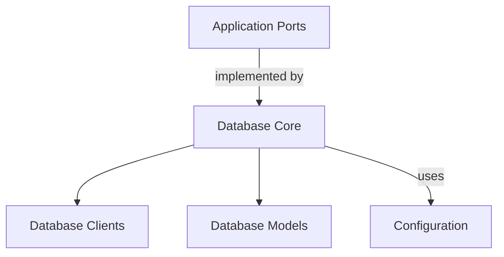

# Database Adapters Module

## Introduction and Purpose
The `database_adapters` module provides a crucial layer for abstracting database interactions within the system. It offers a flexible and configurable way to connect to various database systems, primarily PostgreSQL and SQLite, and defines the data models used for persistence. This module ensures that the application can store and retrieve critical operational data, such as OOM events and performance statistics, in a reliable manner, decoupling the application logic from the underlying database technology.

## Architecture Overview
The `database_adapters` module is structured into several key sub-modules, each responsible for a specific aspect of database management. This modular design promotes maintainability and allows for easy extension to support additional database types or data models in the future.

<!-- DIAGRAM_JSON
{
    "direction": "TD",
    "nodes": [
        {"id": "database_clients", "label": "Database Clients", "type": "module", "link": "database_clients.md"},
        {"id": "database_core", "label": "Database Core", "type": "module", "link": "database_core.md"},
        {"id": "database_models", "label": "Database Models", "type": "module", "link": "database_models.md"},
        {"id": "configuration", "label": "Configuration", "type": "external", "link": "configuration.md"},
        {"id": "application_ports", "label": "Application Ports", "type": "external", "link": "application_ports.md"}

    ],
    "edges": [
        {"source": "database_core", "target": "database_clients"},
        {"source": "database_core", "target": "database_models"},
        {"source": "database_core", "target": "configuration", "label": "uses"},
        {"source": "application_ports", "target": "database_core", "label": "implemented by"}
    ],
    "groups": []
}
-->

## Sub-modules

### [Database Clients](database_clients.md)
This sub-module is responsible for defining the interfaces and providing concrete implementations for various database client factories. It enables the system to create connections to different database types, such as PostgreSQL and SQLite, based on the application's configuration.

### [Database Core](database_core.md)
As the central component for database operations, this sub-module manages the primary database connection using GORM. It handles the initialization, configuration, and fundamental interactions with the underlying database system, facilitating data persistence and retrieval for the application.

### [Database Models](database_models.md)
This sub-module defines the crucial data structures and schemas used to represent application-specific data within the database. It includes models for storing `OOMEvent`s and various `Stats`, ensuring that all persistent data adheres to a consistent and well-defined structure.

## Integration with Other Modules

- **[Configuration](configuration.md)**: The `database_adapters` module relies heavily on the `configuration` module to retrieve database connection settings and other operational parameters. The `DatabaseConfig` within this module directly corresponds to configurations provided by the system's overall settings.

- **[Application Ports](application_ports.md)**: This module implements the `Database` interface defined in the `application_ports` module. This adherence to an interface ensures a clean separation of concerns and allows other parts of the system to interact with the database through a consistent API, regardless of the underlying database implementation details.