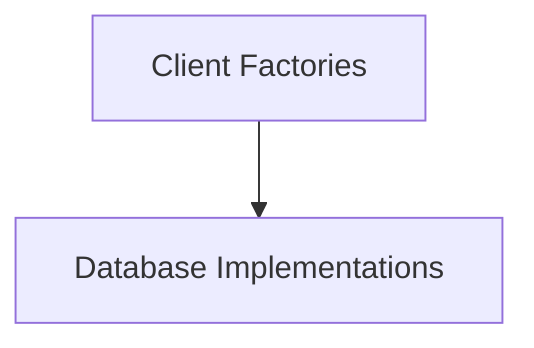

# Database Clients Module

The `database_clients` module is responsible for abstracting the creation of database client instances. It provides a flexible factory pattern that allows the application to dynamically connect to various database systems, such as PostgreSQL and SQLite, based on configuration.

## Architecture Overview

This module employs a factory pattern to decouple the client creation logic from the application's core. The `ClientFactory` interface defines a contract for creating database connections, while `FactoryConfig` provides the necessary parameters for these connections. Specific implementations like `PostgreSQLClientFactory` and `SQLiteClientFactory` handle the details of establishing connections to their respective database types.

This architecture ensures that new database types can be easily integrated by implementing the `ClientFactory` interface without altering the core application logic. It integrates with the [database_core](database_core.md) module, which likely uses these clients to manage GormDB instances.

<!-- DIAGRAM_JSON
{
    "direction": "TD",
    "nodes": [
        {"id": "client_factories", "label": "Client Factories", "type": "module", "link": "client_factories.md"},
        {"id": "database_implementations", "label": "Database Implementations", "type": "module", "link": "database_implementations.md"}
    ],
    "edges": [
        {"source": "client_factories", "target": "database_implementations"}
    ],
    "groups": []
}
-->

## Sub-modules

### [Client Factories](client_factories.md)
This sub-module defines the core interfaces and configuration structures for creating database clients. It includes the `ClientFactory` interface and the `FactoryConfig` structure, enabling a standardized approach to database connection setup.

### [Database Implementations](database_implementations.md)
This sub-module provides concrete implementations of the `ClientFactory` for specific database systems. It includes `PostgreSQLClientFactory` and `SQLiteClientFactory`, detailing how to establish connections to PostgreSQL and SQLite databases, respectively.
