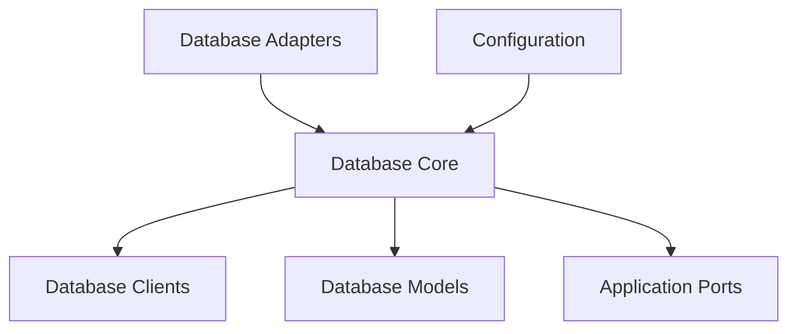

# Database Core Module

## Introduction

The `database_core` module provides the foundational components for interacting with the application's database. It encapsulates the core database connection logic using GORM and defines the structure for database configuration. This module serves as the central point for database operations, ensuring consistent data access and management across the system.

## Architecture

The `database_core` module is a key part of the `database_adapters` family, interacting with various components to establish and manage database connections. It relies on `database_clients` to provide specific database implementations (e.g., PostgreSQL, SQLite) and works with `database_models` to define the data structures stored in the database. The `DatabaseConfig` component within this module outlines the necessary parameters for connecting to the database, which are typically populated by the overarching [configuration](configuration.md) module.

<!-- DIAGRAM_JSON
{
    "direction": "TD",
    "nodes": [
        {"id": "database_core", "label": "Database Core", "type": "module", "link": "database_core.md"},
        {"id": "database_adapters", "label": "Database Adapters", "type": "module", "link": "database_adapters.md"},
        {"id": "database_clients", "label": "Database Clients", "type": "module", "link": "database_clients.md"},
        {"id": "database_models", "label": "Database Models", "type": "module", "link": "database_models.md"},
        {"id": "configuration", "label": "Configuration", "type": "module", "link": "configuration.md"},
        {"id": "application_ports", "label": "Application Ports", "type": "module", "link": "application_ports.md"}
    ],
    "edges": [
        {"source": "database_adapters", "target": "database_core"},
        {"source": "database_core", "target": "database_clients"},
        {"source": "database_core", "target": "database_models"},
        {"source": "configuration", "target": "database_core"},
        {"source": "database_core", "target": "application_ports"}
    ],
    "groups": []
}
-->

## Core Functionality

The `database_core` module provides the following key functionalities:

### `pkg.adapters.database.database.GormDB`

This component represents the core GORM database instance. It encapsulates the `*gorm.DB` object, providing a wrapper for all database interactions. Through `GormDB`, other parts of the application can perform CRUD (Create, Read, Update, Delete) operations, transactions, and other database-related tasks in a consistent and type-safe manner.

### `pkg.adapters.database.database.DatabaseConfig`

The `DatabaseConfig` struct defines the configuration parameters required to establish a connection to the database. It includes fields such as `Type` (e.g., "sqlite", "postgres"), `Host`, `Port`, `Database` name or file path, `Username`, `Password`, and `SSLMode` for PostgreSQL connections. This configuration is crucial for correctly initializing the database connection and ensuring secure access.
