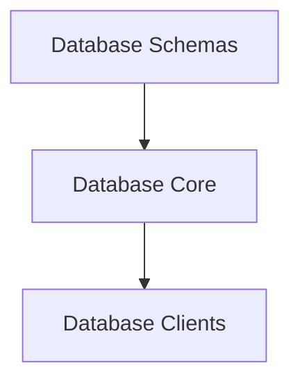

# Database Models

The `database_models` module is a crucial component within the `database_adapters` module, responsible for defining the data structures and schemas used to persist various types of information within the application's database. It primarily focuses on representing critical system events and performance statistics.

## Architecture Overview

This module defines the foundational database models, providing a structured way to interact with the underlying data store. It works in conjunction with the [database_core](database_core.md) module, which handles the actual database connection and operations, and the [database_clients](database_clients.md) module, which provides client factories for different database types.

<!-- DIAGRAM_JSON
{
    "direction": "TD",
    "nodes": [
        {"id": "database_schemas", "label": "Database Schemas", "type": "module", "link": "database_schemas.md"},
        {"id": "database_core", "label": "Database Core", "type": "module", "link": "database_core.md"},
        {"id": "database_clients", "label": "Database Clients", "type": "module", "link": "database_clients.md"}
    ],
    "edges": [
        {"source": "database_schemas", "target": "database_core"},
        {"source": "database_core", "target": "database_clients"}
    ],
    "groups": []
}
-->

## Module Functionality

### Database Schemas
The `database_schemas` sub-module defines the Go structs that map directly to database tables. These models, such as `OOMEvent` and `Stats`, dictate the structure of the data stored, including column names, types, and indexing strategies.
Refer to the [database_schemas.md](database_schemas.md) for detailed documentation.
