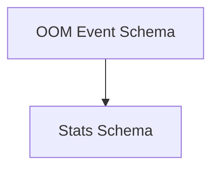

# Database Schemas Module

## Introduction

The `database_schemas` module defines the data structures (schemas) used for persisting information related to OOM events and workload statistics within the system. It is a crucial part of the overall [database_adapters.md](database_adapters.md) module, specifically residing under [database_models.md](database_models.md), ensuring consistency and integrity of data stored in the underlying database.

## Architecture Overview

The `database_schemas` module primarily consists of Go structs that are mapped to database tables using GORM annotations. These schemas represent the core entities for OOM events and workload statistics, which are then used by the database layer for data persistence and retrieval.

<!-- DIAGRAM_JSON
{
    "direction": "TD",
    "nodes": [
        {"id": "oom_event_schema", "label": "OOM Event Schema", "type": "module", "link": "oom_event_schema.md"},
        {"id": "stats_schema", "label": "Stats Schema", "type": "module", "link": "stats_schema.md"}
    ],
    "edges": [
        {"source": "oom_event_schema", "target": "stats_schema"}
    ],
    "groups": []
}
-->

## Sub-modules

### OOM Event Schema (`oom_event_schema.md`)
Defines the database schema for storing Out-Of-Memory (OOM) events, including details like cluster ID, container ID, pod name, and timestamps. For more details, refer to [oom_event_schema.md](oom_event_schema.md).

### Stats Schema (`stats_schema.md`)
Defines the database schema for storing workload statistics, including cluster ID, workload ID, and JSON-encoded statistics and overrides. For more details, refer to [stats_schema.md](stats_schema.md).
