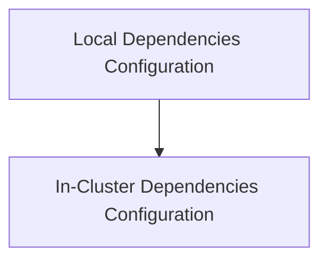

# Dependency Management Module

## Introduction
The `dependency_management` module is responsible for defining and configuring external dependencies required by the system, distinguishing between local development environments and in-cluster deployments. It ensures that the application can correctly locate and interact with services like Kubernetes and Prometheus based on its operational context.

## Architecture Overview
This module primarily consists of configuration structures that encapsulate various dependency settings. It provides distinct configurations for local development setups and in-cluster environments, allowing for flexible and environment-aware dependency resolution.

<!-- DIAGRAM_JSON
{
    "direction": "TD",
    "nodes": [
        {"id": "local_dependencies", "label": "Local Dependencies Configuration", "type": "module", "link": "local_dependencies.md"},
        {"id": "in_cluster_dependencies", "label": "In-Cluster Dependencies Configuration", "type": "module", "link": "in_cluster_dependencies.md"}
    ],
    "edges": [
        {"source": "local_dependencies", "target": "in_cluster_dependencies"}
    ],
    "groups": []
}
-->

## Sub-modules
This module is composed of the following key sub-modules:

### [Local Dependencies Configuration](local_dependencies.md)
This sub-module defines the configuration for dependencies when the application is running in a local development environment. It includes settings such as the path to the Kubernetes kubeconfig file and the URL for a local Prometheus instance.

### [In-Cluster Dependencies Configuration](in_cluster_dependencies.md)
This sub-module handles the configuration of dependencies when the application is deployed within a Kubernetes cluster. Its primary focus is on specifying the URL for the in-cluster Prometheus instance.
