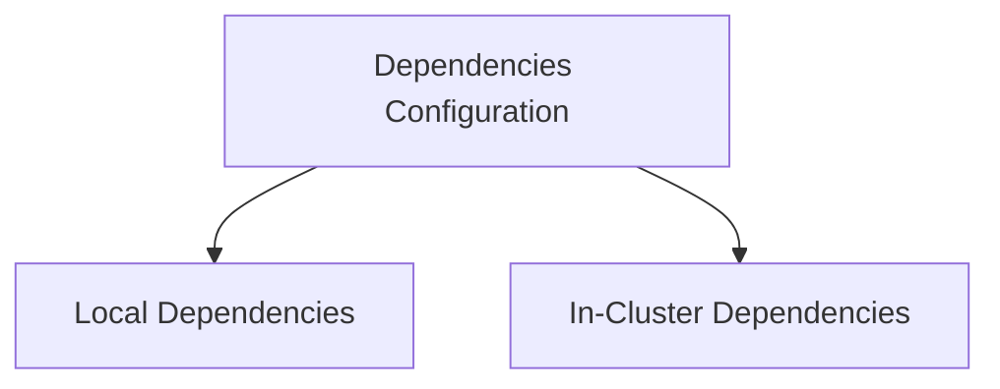

# Dependency Overview Module

The `dependency_overview` module, part of the broader `configuration` system, defines the top-level structure for managing both local and in-cluster application dependencies. It serves as a central point for consolidating dependency configurations, enabling the application to adapt to different deployment environments.

## Architecture and Component Relationships

This module primarily exposes the `Dependencies` structure, which encapsulates references to `LocalDeps` and `InClusterDeps`. This clear separation allows for distinct management of dependencies based on whether the application is running in a local development environment or within a Kubernetes cluster.

### Core Components

*   **`pkg.config.config.Dependencies`**: This is the main structure that holds the configuration for both local and in-cluster dependencies. It acts as an aggregation point for all dependency-related settings within the application's configuration.

### Module Dependencies

The `dependency_overview` module depends on the following modules for its complete functionality:

*   **`local_dependencies`**: Provides the structure and configuration for local development dependencies.
*   **`in_cluster_dependencies`**: Provides the structure and configuration for dependencies specific to an in-cluster deployment.

## How it Fits into the Overall System

As a sub-module of `local_dependencies` and ultimately `configuration`, `dependency_overview` plays a crucial role in the application's bootstrap and runtime. It ensures that the application can correctly identify and utilize its required services and resources, whether they are externally provisioned (e.g., databases, metrics providers) or internally managed. By centralizing dependency configuration, it simplifies environment setup and promotes consistency across different operational contexts.

<!-- DIAGRAM_JSON
{
    "direction": "TD",
    "nodes": [
        {"id": "dependency_overview_dependencies", "label": "Dependencies Configuration", "type": "component", "link": null},
        {"id": "local_dependencies", "label": "Local Dependencies", "type": "external", "link": "local_dependencies.md"},
        {"id": "in_cluster_dependencies", "label": "In-Cluster Dependencies", "type": "external", "link": "in_cluster_dependencies.md"}
    ],
    "edges": [
        {"source": "dependency_overview_dependencies", "target": "local_dependencies"},
        {"source": "dependency_overview_dependencies", "target": "in_cluster_dependencies"}
    ],
    "groups": []
}
-->
