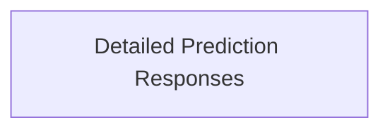

<!-- AUTO_GENERATED_PLACEHOLDER
  reason: LLM did not create .md file for this module
  module_path: task_utilities/prediction_and_types/prediction_responses/detailed_prediction_responses
  component_count: 2
  generated_at: 2026-02-03T14:34:07.350455
  TODO: Fix LLM prompt to handle small leaf modules
-->

# Detailed Prediction Responses

> ⚠️ **Auto-Generated Placeholder**
> This documentation was auto-generated because the LLM failed to create it.
> Module path: `task_utilities/prediction_and_types/prediction_responses/detailed_prediction_responses`

Handles various prediction response structures, including simple and statistical formats for different entities.

## Components

This module contains 2 component(s):

- `pkg.task.utils.types.SimplePredictionResponse`
- `pkg.task.utils.types.PredictionStatsResponse`

## Structure

---
*Auto-generated placeholder. See sync_issues.json for details.*
