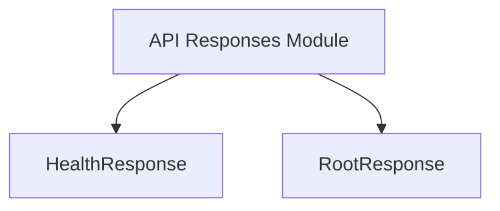

# general_api_responses Module Documentation

## Introduction

The `general_api_responses` module defines common data structures used for API responses within the recommender service client. Specifically, it includes fundamental response types like `HealthResponse` for service health checks and `RootResponse` for providing basic API endpoint information.

This module plays a crucial role in standardizing the basic communication protocols and ensuring consistency in how the client interprets the service's operational status and available functionalities.

## Architecture and Component Relationships

This module is a leaf module within the `recommender_client` component, specifically nested under `recommender_client` -> `api_data_models` -> `api_responses`. It provides core response structures consumed by the parent `api_responses` module and, by extension, other parts of the client that interact with the recommender service.

<!-- DIAGRAM_JSON
{
    "direction": "TD",
    "nodes": [
        {"id": "health_response", "label": "HealthResponse", "type": "component", "link": null},
        {"id": "root_response", "label": "RootResponse", "type": "component", "link": null},
        {"id": "api_responses", "label": "API Responses Module", "type": "external", "link": "api_responses.md"}
    ],
    "edges": [
        {"source": "api_responses", "target": "health_response"},
        {"source": "api_responses", "target": "root_response"}
    ],
    "groups": []
}
-->



### Components

#### `HealthResponse`

```go
type HealthResponse struct {
	Status string `json:"status"`
}
```

This structure represents the response for a health check endpoint. It typically contains a `Status` field indicating the current health of the service (e.g., "OK", "Unhealthy").

#### `RootResponse`

```go
type RootResponse struct {
	Message   string            `json:"message"`
	Endpoints map[string]string `json:"endpoints"`
}
```

The `RootResponse` provides general information about the service's root endpoint. It includes a `Message` (e.g., a welcome message or service description) and a map of `Endpoints`, detailing other available API paths and their associated URLs.

## How it Fits into the Overall System

The `general_api_responses` module is foundational for the [recommender_client](recommender_client.md). It provides the basic data models for interpreting standard API responses from the recommender service. These responses are crucial for:

*   **Service Health Monitoring:** `HealthResponse` allows the client to quickly ascertain the operational status of the recommender service.
*   **API Discovery:** `RootResponse` enables dynamic discovery of available API endpoints, facilitating flexible client-service interactions.

By defining these common response structures, the module ensures that the client can reliably communicate with the recommender service and understand its fundamental operational state and capabilities. It is directly used by the [api_responses](api_responses.md) module, which aggregates various API response models within the client structure.