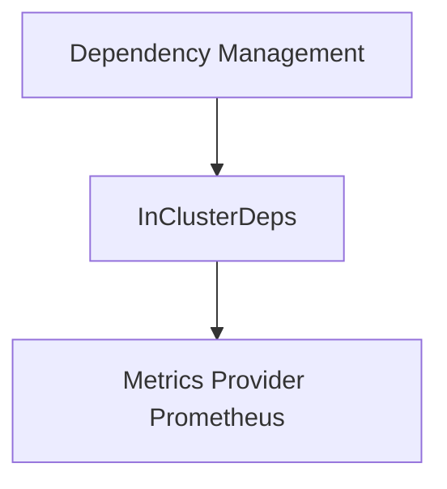

# in_cluster_dependencies

The `in_cluster_dependencies` module defines the configuration for services that reside within the same cluster as the application. Its primary role is to specify how the application can connect to these internal services.

### Core Functionality
The `pkg.config.config.InClusterDeps` struct serves as a data structure to encapsulate configuration details for in-cluster dependencies. As of now, it contains:
*   `PrometheusURL`: A string representing the URL for the Prometheus server within the cluster. This is crucial for fetching metrics.

### Architecture and Component Relationships
This module is a leaf module within the `configuration` hierarchy, specifically nested under `dependency_management`. It acts as a configuration provider for components that require access to in-cluster services. The `InClusterDeps` struct is consumed by modules such as `metrics_provider_prometheus` [metrics_provider_prometheus.md] to establish connections and perform operations like metric fetching.

The `in_cluster_dependencies` module does not have internal sub-components beyond its core configuration struct. Its relationships are primarily with its parent configuration modules and external modules that consume its defined configuration.

### How it fits into the Overall System
The `in_cluster_dependencies` module is a critical part of the application's configuration layer. It ensures that the application can correctly identify and connect to essential services deployed within the same Kubernetes cluster, such as Prometheus. Without this configuration, components like the `metrics_provider_prometheus` would be unable to gather necessary operational data. It abstracts away the specific in-cluster service endpoints, making the application more flexible and easier to deploy in different cluster environments. It is a specific type of `dependency_management` [dependency_management.md] configuration.

<!-- DIAGRAM_JSON
{
    "direction": "TD",
    "nodes": [
        {"id": "in_cluster_deps", "label": "InClusterDeps", "type": "component", "link": null},
        {"id": "metrics_provider_prometheus", "label": "Metrics Provider Prometheus", "type": "external", "link": "metrics_provider_prometheus.md"},
        {"id": "dependency_management", "label": "Dependency Management", "type": "external", "link": "dependency_management.md"}
    ],
    "edges": [
        {"source": "dependency_management", "target": "in_cluster_deps"},
        {"source": "in_cluster_deps", "target": "metrics_provider_prometheus"}
    ],
    "groups": []
}
-->
