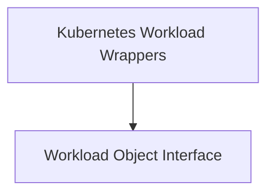

# Kubernetes Workload Wrappers

## Introduction

The `kubernetes_workload_wrappers` module provides a set of interfaces and concrete implementations for interacting with various Kubernetes workload types, such as Deployments, DaemonSets, and StatefulSets. It aims to abstract the underlying Kubernetes API objects, offering a unified way to manage and query workload-specific information, particularly within the context of task utilities and resource optimization.

## Architecture Overview

This module is structured to separate the common interface definition from the specific implementations for each Kubernetes workload type. The core components define how different workloads can be treated uniformly, while specific wrappers provide the necessary adaptations for each type.

<!-- DIAGRAM_JSON
{
    "direction": "TD",
    "nodes": [
        {"id": "workload_interface", "label": "Workload Object Interface", "type": "module", "link": "workload_interface.md"},
        {"id": "workload_wrappers", "label": "Kubernetes Workload Wrappers", "type": "module", "link": "workload_wrappers.md"}
    ],
    "edges": [
        {"source": "workload_wrappers", "target": "workload_interface"}
    ],
    "groups": []
}
-->

## Sub-modules

### [Workload Object Interface](workload_interface.md)
This sub-module defines a common interface (`WorkloadObject`) that abstracts the details of different Kubernetes workload objects. It specifies methods for retrieving essential information like namespace, name, container specifications, and creation time, enabling uniform interaction regardless of the underlying workload type.

### [Kubernetes Workload Wrappers](workload_wrappers.md)
This sub-module provides concrete wrapper types for specific Kubernetes workload kinds, including `DeploymentWrapper`, `DaemonSetWrapper`, and `StatefulSetWrapper`. These wrappers embed the respective Kubernetes API objects and implement the `WorkloadObject` interface, allowing them to be treated generically while still providing access to their specific fields. This enables consistent processing of various workloads within the system, particularly for tasks related to metrics collection and resource management.
