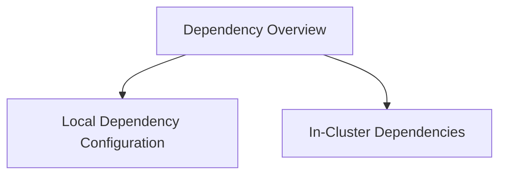

# Local Dependencies Module

The `local_dependencies` module is responsible for defining and managing configurations related to local development and operational dependencies within the system. It primarily focuses on specifying paths for local Kubernetes configuration (`kubeconfig`) and the URL for a local Prometheus instance.

This module is a crucial part of the overall [configuration](configuration.md) system, specifically nested under [dependency_management](dependency_management.md).

## Architecture Overview

Below is an architecture diagram illustrating the components within the `local_dependencies` module and its relationship with other related configuration aspects.

<!-- DIAGRAM_JSON
{
    "direction": "TD",
    "nodes": [
        {"id": "dependency_overview", "label": "Dependency Overview", "type": "module", "link": "dependency_overview.md"},
        {"id": "local_dependency_config", "label": "Local Dependency Configuration", "type": "module", "link": "local_dependency_config.md"},
        {"id": "in_cluster_dependencies", "label": "In-Cluster Dependencies", "type": "module", "link": "in_cluster_dependencies.md"}
    ],
    "edges": [
        {"source": "dependency_overview", "target": "local_dependency_config"},
        {"source": "dependency_overview", "target": "in_cluster_dependencies"}
    ],
    "groups": []
}
-->

## Sub-modules

### [Dependency Overview](dependency_overview.md)
This sub-module, represented by `pkg.config.config.Dependencies`, provides a comprehensive structure for managing both local and in-cluster dependencies. It acts as a wrapper, consolidating different dependency types into a single configuration entity.

### [Local Dependency Configuration](local_dependency_config.md)
This sub-module, primarily defined by `pkg.config.config.LocalDeps`, handles the specific configurations for local dependencies. It includes essential parameters such as `KubeconfigPath` for Kubernetes cluster access and `PrometheusURL` for monitoring and metrics collection in a local environment. These settings are critical for development and testing workflows where local resources are utilized.
